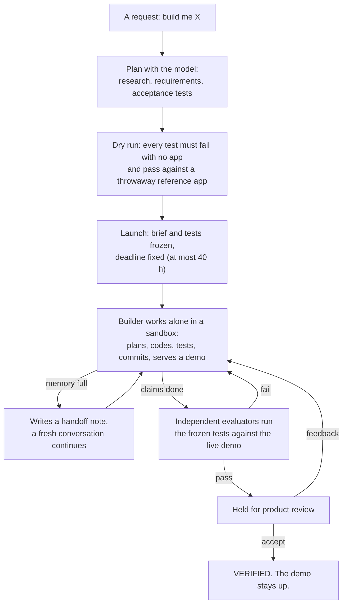

# dgx-autonomy

**Give an open-weights model a product brief and a computer that fits on a desk. Walk away. Come back to a working app.**

dgx-autonomy is an environment for letting a local model build software unattended for up to 40 hours. It runs on a single NVIDIA DGX Spark. No cloud model writes the code, nobody answers the builder's questions, and there's no per-token bill. The builder works inside a locked-down sandbox with a small set of tools. It isn't done when it *says* it's done. It's done when acceptance tests it can't touch say so.

## Why

Putting a frontier model in a loop is no longer news. Claude or GPT in a `while true`, pointed at a task, has been a thing for a while, and it works remarkably well. It also means paying API costs to build the thing, and often again to run the models inside it.

This project asks a different question: **how far can open-weights models on hardware you own get, if you're willing to trade speed for patience?**

A desk-sized box decodes at roughly 20 tokens a second, a fraction of what a data centre does. The bet is that it doesn't matter. If the model can keep going for 40, 60 or 80 hours, stay on track, recover from its own mistakes, and be held to an objective standard, then speed matters less than persistence.

That's also an argument for **sovereign AI**:

- **Your model.** The weights sit on your disk. Nobody can reprice, rate-limit or deprecate them.
- **Your hardware.** The builder and the model run on the same box. The running cost is electricity.
- **Your data.** Briefs, code and conversations never leave the machine. The only traffic out is what the builder and its app fetch: packages, documentation and public APIs.

## What it has built

| Project | What it is | Result |
|---|---|---|
| [**Shoreline**](https://github.com/EduardKakosyan/shoreline) · [live](https://eduardkakosyan.github.io/shoreline/) | A mobile-first app for a day at the water: beach and fishing verdicts with reasons, today's tides, sea state, the moon and the forecast. It grew from a weather app over three runs. | 42 commits, 19/19 acceptance checks (78 tests), accepted after product review. The Shoreline brief itself took about 8 hours of a 40-hour budget. |
| [**Camp Yahtzee**](https://github.com/EduardKakosyan/yahtzee) · [live](https://eduardkakosyan.github.io/yahtzee/) | Official-rules Yahtzee for one iPhone passed around a camp table: 1–8 players, real or on-screen dice, game after game with a session tally, installable and offline. | 18 commits, 24/24 acceptance tests after two review rounds, accepted. All checks were green about 2 hours in. |

Currently building: **Keeper**, a self-hosted meeting memory (archive, search, REST API and an MCP server) meant to replace a SaaS notetaker. Confidential conversations stay on hardware you own, and the model that builds it runs there too.

Each project repo carries its own loop record: the frozen brief and acceptance checks for every run, and every message the operator sent the builder.

## How it works



### 1. Agree on "done" before anything is built

A planning session pairs the operator with the same model that will build the app. Together they research the request (the planner can use `curl`) and write two things:

- **A brief.** What to build and for whom, written so that a builder working alone for 40 hours never needs to ask a question.
- **Acceptance checks.** Executable Playwright and pytest tests, plus criteria that only a human can judge.

Before launch, a **dry run tests the tests**. Every check must *fail* when no app is running; a check that passes there checks nothing. Every check must also *pass* against a throwaway reference app the planner writes; a check that fails there couldn't be satisfied by any app. That second mistake slipped past careful planning once: a locator that matched two labels on any page.

At launch the brief and checks are **frozen** with a digest. The builder can read them but not write them, and the digest is checked again before every evaluation.

### 2. Build, alone

The builder is an [OpenHands](https://github.com/OpenHands/software-agent-sdk) agent. OpenHands supplies the think → act → observe loop. This project supplies everything around it.

| Tools the builder has | |
|---|---|
| terminal, file editor, task tracker | OpenHands built-ins. The builder installs packages, runs tests and drives its own headless browser. |
| `start_demo` | Serves the app. It's the only thing that keeps running after the builder stops. |
| `report_progress` | A line in the operator's notification feed. |
| `write_handoff` | The builder's structured note to its future self when a conversation is replaced. |
| `declare_blocked` | "No viable path is left." A fresh conversation must confirm it before the run ends. |
| `finish` | A **claim** that the work is done. Nothing more. |

The custom tools can only *ask*. Each one writes a request, the controller outside the sandbox validates it, and the answer comes back through a read-only directory.

### 3. "Done" is a claim

When the builder finishes, the controller:

1. **pins** the project in its own git store (not the builder's, whose hooks it doesn't trust);
2. makes sure the demo serves exactly that snapshot;
3. runs each frozen check in its own disposable, unprivileged evaluator container, against the live demo;
4. snapshots again, and rejects the result if anything changed mid-test.

If every required check passes, the run is **VERIFIED**. Otherwise the builder receives each failure with the assertion's expected and received values, and keeps going.

A test runner that crashes, times out or gets killed is an infrastructure error: never a pass, and never blamed on the app. The report keeps four things apart: what the builder claimed, what the checks proved, what awaits human judgment, and any optional review by a stronger model.

### 4. Memory that outlives the context window

A 40-hour run can't fit in one conversation. The controller replaces the conversation when:

- its context is nearly full;
- it gets stuck repeating itself;
- it keeps erroring;
- three claims in a row fail.

Before the old conversation goes, it writes a **handoff**: a roadmap, decisions, approaches that failed, and next steps. The controller validates it. An item marked done has to cite evidence: a file that exists, or an evaluation that ran. The builder is not allowed to call anything "verified", because only the environment records that.

The fresh conversation starts from the frozen brief, that handoff (labelled as claims, not facts), what the environment actually verified, and any operator feedback. After a stuck or failing streak it's told to diagnose first and change approach. Shoreline's final run used six conversations.

### 5. Product review

Tests catch regressions, but they don't catch "the sun looks brown". A run can be **held**: a passing claim waits for the operator. The operator opens the live demo, then either accepts it or sends product feedback: what a user sees and should feel, never how to code it. The frozen checks still decide completion. Feedback raises the bar on top of them.

### 6. The boundary

- The builder runs as an unprivileged user with no Linux capabilities and no sudo.
- It sees only its workspace, the frozen brief and a read-only control directory. It has no Docker socket.
- It can reach the internet, but host firewall rules reject the machine itself, the LAN and the private network.
- It holds no API keys and no payment details. Operating restrictions are boundaries, not obstacles to route around.
- The deadline is written once and enforced by its own watchdog thread.
- On stop, the controller kills every agent process (pausing the conversation alone was measured not to be enough). The demo stays up.
- The controller survives crashes and reboots. Each step records its intent before acting and checks what already exists before repeating anything.

## The local model

The builder is **Qwen3.8-Flash-Next**, a 125-billion-parameter open-weights model, running on a DGX Spark with 128 GB of unified memory. Three properties make a model that size practical on one box:

- **Mixture of experts.** Each token uses only about 6B of the 125B parameters. Generation speed on this hardware is limited by how much it reads from memory per token, so this is the main reason it's usable.
- **Hybrid attention.** Only 12 of its 48 layers keep a memory of every past token; the rest keep a fixed-size running state. A 256K-token context costs about 3 GB instead of tens.
- **Sparse attention.** Each new token attends only to the most relevant blocks of the context, not to all of it.

It's served by [SGLang](https://github.com/sgl-project/sglang) from a 4-bit NVFP4 checkpoint. SGLang has real sparse-attention kernels and uses the model's **multi-token prediction** heads for speculative decoding: a small head drafts 4 tokens, and the full model checks them in one pass. The first backend was llama.cpp, which computes the sparse attention densely under a mask. It slowed down as the context filled:

| Context in use | llama.cpp (Q3 GGUF) | SGLang (NVFP4 + MTP) |
|---|---|---|
| near empty | ~25 tok/s | ~21–25 tok/s |
| 100–125K | ~13 tok/s | ~21–25 tok/s |
| 150–175K | ~10 tok/s | ~21 tok/s |
| 200K+ | ~8 tok/s | — |
| prompt reading (205K tokens) | 387 tok/s | 1,940 tok/s |

The SGLang figures are medians from a live build, sampled up to 180K tokens of context. The prompt-reading row comes from qualification. The builder spends most of its time above 100K tokens, so SGLang roughly doubled its effective speed.

A model is only used after **qualification** on the target machine, with the whole workload running alongside it:

- five tool-calling probes;
- a prompt filling 75% of the context, with a word to recall from its start;
- a real build that must end VERIFIED;
- memory and swap sampled throughout.

A smaller fallback, Qwen3.6-35B-A3B (about 17 GB), is also qualified and decodes at about 52 tok/s.

## The human (and Claude) in the loop

This isn't about replacing frontier models. They're the best supervisors available. During these runs a Claude session followed the DGX's notification feed (launches, progress, claims, evaluations, handoffs). It flagged when something needed attention, reviewed the live apps alongside the operator, and helped write product feedback and new feature requests. The local model wrote every line of the apps. Frontier models manage; the open model builds, around the clock.

## What we learned

- **Verification is the whole game.** Local models claim success early and confidently. A test they can't edit, run from outside the app, turns "I think it works" into evidence.
- **Test the tests.** Checks that pass with no app, and checks no app can pass, are both easy to write. One of the second kind got past careful planning, and the dry run against a reference app caught it.
- **Persistence beats speed.** The builder diagnosed its own bugs across conversations. It built a pixel detector to hunt down a visual smudge from feedback, and a 7,776-roll dice oracle to prove its scoring.
- **Handoffs need enforcement.** One builder ignored a handoff request for 43 minutes while its context filled. A reminder after every three unrelated actions got a handoff within a minute.
- **Bound everything.** An uncapped response ran 10,000+ tokens of thinking for 20 minutes. Response length, thinking budget and request timeout are now set per model.
- **Model servers differ in ways that matter.** SGLang refuses a request whose prompt plus maximum output exceeds the context; llama.cpp never did. The rollover threshold now leaves room for a full response.
- **Small frictions compound.** One run hit 21 refused terminal commands in 6 hours, because OpenHands rejects multi-line input such as a heredoc followed by its command. A small patch runs such input as one block.
- **Tests aren't taste.** Every product review found something the checks couldn't see, like a keypad whose badges hid a pip so a 4 read as a 3. The review hold exists for this.
- **The operator needs a pager.** Three held runs waited hours for review because the monitoring session had ended. Notifications need to outlive the laptop.

## Running it yourself

You need a Linux machine with an NVIDIA GPU and enough memory for the model you choose, plus the workload beside it. The builder's sandbox, its demo and a headless browser need about 16 GB.

| Model | Weights | Fits on |
|---|---|---|
| Qwen3.8-Flash-Next (NVFP4, SGLang) | ~101 GB resident, plus a 48 GB lookup table on NVMe | a 128 GB DGX Spark, on its own |
| Qwen3.8-Flash-Next (Q3 GGUF, llama.cpp) | ~84 GB | a 128 GB machine |
| Qwen3.6-35B-A3B (Q3 GGUF, llama.cpp) | ~17 GB | much smaller machines |

Beyond that:

- **Software:** Docker with the NVIDIA container runtime, nftables, and [uv](https://docs.astral.sh/uv/) for the Python tooling.
- **Model catalog:** models are declared in [`config/models.yaml`](config/models.yaml): weights, context, backend and limits. The inference image is built for the GB10's GPU architecture, so rebuild it for other GPUs.

Some parts are specific to the reference machine, and you would adapt them:

- the user and host names;
- the host firewall rules (`host/nftables-autonomy.nft`), which name its LAN and tailnet;
- the **reservation** (`host/`, `reservation.py`), which borrows GPU memory from another inference service on the same box. Leave it out if the machine is yours alone.

To try the loop:

```bash
uv sync
uv run pytest -m "not dgx"             # about 390 tests; no GPU, Docker or model needed

# on the target machine, after building the images and starting the controller:
dgx-autonomy qualify MODEL             # prove the model can do the job on this box
dgx-autonomy plan --model MODEL        # agree on a brief and checks with the model
dgx-autonomy notify --follow           # watch milestones as they happen
dgx-autonomy tunnel RUN_ID             # open the demo from your laptop
```

The [operator manual](docs/operator-manual.md) covers setup, every command, and each mechanism in detail.

## Repository map

| Path | What's there |
|---|---|
| `src/dgx_autonomy/controller.py` | The controller: run lifecycle, evaluations, rollovers, recovery, stop |
| `src/dgx_autonomy/openhands_adapter.py` | How conversations are created and observed through the OpenHands Agent Server |
| `src/dgx_autonomy/{demo_tool,handoff_tool,terminal_grouping}.py` | The builder's custom tools and the terminal patch |
| `src/dgx_autonomy/{frozen,snapshot,evaluation}.py` | Frozen agreements, snapshots, and running the checks |
| `src/dgx_autonomy/{checkpoints,planning}.py` | Handoffs and recovery context; the planner |
| `src/dgx_autonomy/{inference,qualify}.py` | Serving models (llama.cpp and SGLang) and qualifying them |
| `containers/` | The agent, evaluator, inference and controller images, and the in-sandbox supervisor |
| `host/` | Host firewall rules, the reservation helper and the busy notice |
| `docs/operator-manual.md` | The full manual for the reference deployment |
| `docs/operator-log.md` | The supervising session's running log: every launch, review, failure and fix |
| `docs/design/` | The research, PRD, technical design and structure outline it was built from |
