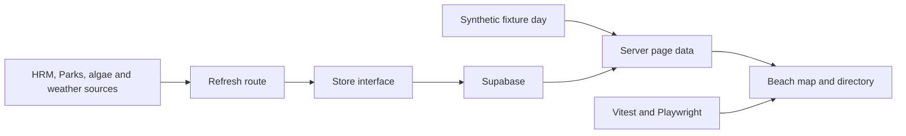
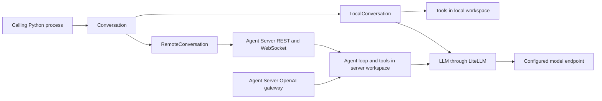

# Research: The local application and upstream runtimes exist independently; DGX access is verified

**Date**: 2026-09-22T14:17:00Z
**Git Commit**: 999ced58a6bcec55680ca32b81f47a694a62ef72
**Branch**: autonomous-coding-agent-research-environment-on-dgx-s4lt7z
**Repository**: claude-hackathon-volta-sep26

## Research Question

The source query is `01-research-questions-dgx-autonomy-environment.md`. Its eight areas are:

1. Inspect the actual `dgx-1` operating system, hardware, memory, storage, runtimes, permissions, services, development directories, and inference installations without changing services or exposing credentials.
2. Separate local and remote implementations, document existing tooling/tests, and record exact frontend styling contracts.
3. Verify the named Qwen and DeepSeek models, licenses, authentication, GGUF artifacts, compatibility, and measured Spark resource requirements.
4. Trace current llama.cpp GB10 build, serving, networking, readiness, cancellation, concurrency, and shutdown contracts.
5. Trace OpenHands SDK versions, APIs, local-model integration, execution location, events, persistence, secrets, and condensation.
6. Establish Docker and Linux ARM64 browser/toolchain behavior and isolation boundaries.
7. Identify existing lifecycle, recovery, durable-memory, checkpoint, deadline, and process-cleanup guarantees.
8. Identify existing independent evaluation, metrics, provenance, browser inspection, and restart-verification interfaces.

## Research Methodology (verbatim)

This document will remain objective and factual. It does not contain any recommendations or implementation suggestions.
Open questions will not ask Why things haven't been built or what should be built in the future.

There is no "implementation" section - that is intentional.

## Summary

The inspected repository is `is-the-beach-open`, a Next.js 16.3.5 / React 19.2.8 beach-status application. Its persistence, refresh jobs, test infrastructure, and simulator CLI concern beach data and browser behavior. No autonomy harness, inference launcher, experiment supervisor, agent SDK integration, or model evaluation pipeline was found in the inspected application source. Its existing browser suite is useful evidence of an application testing contract, not evidence of an installed DGX research environment.

The initial SSH attempt failed because `dgx-1` is not the configured hostname. A user-requested follow-up succeeded through the existing `hugo-dgx1` alias as `jim`, reaching Tailscale host `dgx1`. The host runs Ubuntu 24.04.4 on ARM64 with GB10, driver 580.159.03, and CUDA compiler 13.0.88. Existing inference is active. Docker is installed but direct daemon access is denied to the tested user. The section 1 follow-up supersedes the original access limitation; remote autonomy repository contents remain uninspected.

Upstream model repositories and GGUF packs were identified, including the exact Q3 shard set for Qwen3.8-Flash-Next. Artifact bytes and advertised context limits do not establish runtime residency or throughput. A follow-up pass located third-party, artifact-pinned Q3 Spark results using a patched runtime, but not full raw benchmark evidence or validation on the target host. OpenHands and llama.cpp independently expose events, persistence, health, usage, and tool interfaces; no inspected local code connects them into a durable experiment lifecycle.

## Detailed Findings

### 1. The configured SSH alias reaches DGX; the original hostname was incorrect

#### Follow-up on 2026-09-22 establishes access and a live baseline

The earlier failed attempt and original evidence table below are retained as inspection history, not the current access state. SSH configuration at `/Users/eduardkakosyan/.ssh/config:3` defines `hugo-dgx1`, hostname `dgx1`, user `jim`, and an existing NVIDIA Sync identity. Tailscale reports `dgx1.tail31115a.ts.net` at `<tailscale-ip>` online. `ssh -o BatchMode=yes -o ConnectTimeout=10 -o StrictHostKeyChecking=yes hugo-dgx1` succeeded. No private key contents were read, host-key checking weakened, configuration changed, or privilege escalation attempted.

Read-only snapshot around 2026-09-22 14:43 UTC:

| Check | Direct result |
|---|---|
| OS / kernel / architecture | Ubuntu 24.04.4 LTS; `6.17.0-1026-nvidia`; `aarch64` |
| GPU / driver | NVIDIA GB10; 580.159.03; nvidia-smi CUDA compatibility 13.0 |
| CUDA compiler | `/usr/local/cuda/bin/nvcc`: V13.0.88; bare `nvcc` absent from noninteractive PATH |
| Existing inference | Active `claude-qwen.service`; nvidia-smi lists a llama-server process under a `...claude/build/bin/` path at 37,238 MiB reported process memory |
| Host memory | 121 GiB total, 42 GiB used, 78 GiB available; 15 GiB swap with 550 MiB used |
| Root storage | `/dev/nvme0n1p3`: displayed 1.9T total, 383G used, 1.4T available |
| Docker / Compose CLI | 29.2.1 / v5.0.2 |
| Docker permission | Daemon socket access denied; `/var/run/docker.sock` is root:docker, mode 0660; jim lacks docker group membership |
| Python / Git | 3.12.3 / 2.43.0 |
| uv | `/home/jim/.local/bin/uv` exists; bare command absent from SSH PATH; version not checked |
| Node / npm / pnpm | Bare commands absent from SSH PATH; no standard NVM version path found; machine-wide absence not established |
| Active service names | claude-qwen, Docker, containerd, Caddy, cloudflared, Tailscale, DGX dashboard/admin, SSH, plus OS services |
| Loopback TCP listeners | 8090, 8081, 11434, 11000, 20241, 39987, plus system DNS/printing ports |
| Other TCP listeners | IPv4 wildcard 8080 and 8710; wildcard SSH 22; Tailscale-address 443 and dynamic listeners |
| Requested port 8000 | No TCP listener in the snapshot; not a reservation or future guarantee |
| Source directories | `/home/jim/src/llama.cpp/`, `/home/jim/src/llama.cpp-claude/` |
| Other development directories | `/home/jim/hugo/`, `/home/jim/hugo-worktrees/`, `/home/jim/onprem-agent/`, `/home/jim/models/`, `/home/jim/logs/`, `/home/jim/dgx-audit/` |

Aggregate GPU memory usage reports `Not Supported`, consistent with the UMA caveat. Snapshot availability is not a model-fit benchmark. Empty formatted Docker fields accompanying permission denial are not real daemon metadata. Listener ownership and endpoints were not inferred from port numbers. Directory/service names establish existence, not implementation contents. No model request, benchmark, container launch, service modification, or remote test suite ran.

#### Initial attempt history

The SSH attempt used noninteractive `BatchMode=yes` and `ConnectTimeout=10`. Resolution failed before authentication. No alternate accounts were tried, no services changed, and no credentials were read.

| Evidence class | Established fact | Boundary |
|---|---|---|
| Direct local inspection | Clean tracked worktree at the revision above; macOS working environment; beach application source | Not an inspection of DGX |
| Direct access attempt | `dgx-1` does not resolve in this session | Does not establish whether the host exists elsewhere |
| NVIDIA hardware documentation | GB10; 20-core Arm CPU; 128 GB coherent LPDDR5x; 273 GB/s bandwidth; CUDA capability 12.1 | Not installed/free resources |
| NVIDIA Founders Edition release notes | Current documentation lists DGX OS 7.5.0, driver 580.159.03, CUDA 13.0.2, kernel 6.17 | Not measured versions; partner release timing differs |
| Unavailable host checks | OS/kernel, `nvidia-smi`, `nvcc`, filesystems, `free`, `lsblk`, Docker/Compose, Python/venv/uv, Git, Node/npm/pnpm, services and ports | None ran remotely |
| Unavailable repository checks | Development directories, existing llama.cpp build flags, model files, run logs, remote autonomy code | Neither existence nor absence established |

NVIDIA explicitly documents unified-memory reporting caveats: `nvidia-smi` can show memory usage as unsupported on this iGPU, while `cudaMemGetInfo` can under-report allocatable memory because some DRAM may be reclaimable through swap. Neither nominal 128 GB capacity nor a GGUF file size is an available-memory measurement. Sources: [hardware](https://docs.nvidia.com/dgx/dgx-spark/hardware.html), [product specifications](https://www.nvidia.com/en-us/products/workstations/dgx-spark/), [CUDA capability](https://developer.nvidia.com/cuda-gpus), [release notes](https://docs.nvidia.com/dgx/dgx-spark/release-notes.html), [known issues](https://docs.nvidia.com/dgx/dgx-spark/known-issues.html).

#### Testing patterns

No host test, container, model load, port probe, or remote test suite ran. Host failures in this report are access limitations, not runtime test failures.

### 2. The local automation refreshes beach data and tests a web application

The application loads page data server-side and renders a client map/directory interface (`app/page.tsx:1`, `components/beach-app.tsx:112`). The hourly Vercel route runs seed, source refresh, conditions refresh, and push delivery; it is deterministic ingestion, not an agent supervisor (`vercel.json:4`, `app/api/refresh/route.ts:16`).



Status precedence is algae closure, HRM, provincial advisory, then seasonal fallback (`lib/ingest/resolve.ts:65`). Current status preserves source text, URL, posting time, and confirmation time; replay data carries a basis such as `scraped`, `verified`, `inferred`, or `calendar`, rather than the complete current-status provenance (`lib/status.ts:19`, `lib/status.ts:32`). Fixtures are explicitly handwritten synthetic data (`lib/fixture/today.ts:7`).

The store boundary has fixture, memory-test, and Supabase implementations. Supabase is selected when both required server-side configuration values exist; production rejects fixture fallback. Database writes use natural-key upserts. PGlite-backed tests validate migration invariants, keys, and policies (`lib/db/store.ts:17`, `lib/db/client.ts:23`, `lib/db/supabase-store.ts:197`, `lib/db/conditions-schema.test.ts:28`). This is application persistence, not agent conversation storage.

No relevant implementation was found for the requested `config/models.yaml`, `inference/`, `supervisor/`, `agent/`, `agent-image/`, `benchmark/`, or `runs/<run-id>/` contracts in inspected application source. Searches covered `app/`, `components/`, `hooks/`, `lib/`, `scripts/`, `e2e/`, `test/`, and `supabase/`; dependencies contain no agent/model SDK. This is a scoped local absence, not a statement about inaccessible remote repositories.

#### Testing patterns

| Interface | Existing behavior | Evidence |
|---|---|---|
| `pnpm test` | Vitest; Node projects for application/library/scripts and jsdom for hooks/components | `package.json:11`, `vitest.config.mts:10` |
| `pnpm e2e` | Five projects: desktop Chromium, iPhone Chromium, iPhone WebKit portrait/landscape, iPad WebKit | `playwright.config.ts:50` |
| Server readiness | URL readiness at port 3000; startup timeout 240 seconds; reuse local server; CI builds and starts production | `playwright.config.ts:73` |
| External target | `PLAYWRIGHT_BASE_URL` disables local web-server launch | `playwright.config.ts:43` |
| Concurrency | CI one worker and one retry; local two workers by default, overridable with `PW_WORKERS` | `playwright.config.ts:32` |
| Artifacts | Always screenshots; first-retry traces/video; HTML and list reporters; `test-results/e2e` | `playwright.config.ts:40` |
| Determinism | Synthetic data without Supabase configuration, blocked map tiles, captured page/worker errors, Chromium push-service stub | `e2e/helpers.ts:17`, `e2e/helpers.ts:26`, `e2e/helpers.ts:57` |
| CI | Installs Chromium/WebKit; typecheck, lint, Vitest, E2E; browser artifact retention 14 days | `.github/workflows/ci.yml:30` |
| Simulator CLI | Manual macOS `xcrun simctl`/`idb` wrapper; PNG/accessibility output; no assertions and not CI | `scripts/sim.ts:3`, `docs/sim.md:3` |
| Simulator unit tests | Injected subprocess runner checks commands/argv without a real simulator | `scripts/sim.test.ts:35`, `scripts/sim.test.ts:141` |

The manifest declares `pnpm@10.12.1`, `@playwright/test:^1.63.0`, and Node 22 type definitions; type definitions are not proof of an installed Node runtime (`package.json:37`, `package.json:43`, `package.json:57`). Static discovery counted 722 Vitest and 45 Playwright test declarations, not executed cases or pass rates. This research did not run the suites.

### 3. The beach visual system overrides neutral shadcn primitives with a fixed light palette

The repository configures shadcn `radix-nova`, RSC/TSX, neutral CSS variables, and Lucide icons (`components.json:2`). Tailwind 4, Radix, CVA, and `tw-animate-css` supply primitives, but the main interface mostly uses native controls with `.beach-*` classes. The global theme supports `.dark`; the beach shell explicitly sets `color-scheme: light` and local colors (`app/globals.css:5`, `components/beach-shell.css:22`, `components/beach-shell.css:44`).

| Semantic token | Light | Dark |
|---|---|---|
| Background / foreground | `oklch(1 0 0)` / `oklch(0.145 0 0)` | `oklch(0.145 0 0)` / `oklch(0.985 0 0)` |
| Card and popover | `oklch(1 0 0)` | `oklch(0.205 0 0)` |
| Primary / foreground | `oklch(0.205 0 0)` / `oklch(0.985 0 0)` | `oklch(0.922 0 0)` / `oklch(0.205 0 0)` |
| Secondary, muted, accent | `oklch(0.97 0 0)` | `oklch(0.269 0 0)` |
| Muted foreground | `oklch(0.556 0 0)` | `oklch(0.708 0 0)` |
| Destructive | `oklch(0.577 0.245 27.325)` | `oklch(0.704 0.191 22.216)` |
| Border / input | `oklch(0.922 0 0)` | white 10% / white 15% |
| Ring | `oklch(0.708 0 0)` | `oklch(0.556 0 0)` |

These semantic values live in `app/globals.css:63` and `app/globals.css:98`. Status tokens are open `#16a34a`, advisory `#f59e0b`, closed `#dc2626`, and off-season/unknown `#9ca3af` (`app/globals.css:58`). The radius base is `0.625rem`, with multipliers `0.6`, `0.8`, `1`, `1.4`, `1.8`, `2.2`, and `2.6` (`app/globals.css:47`).

| Beach token or rule | Exact value |
|---|---|
| Background / panel | `#efeeea` / `#f9f8f4` |
| Ink / muted / rule | `#242a29` / `#626b68` / `#d2d6cf` |
| Accent / accent wash / deep | `#0f5f65` / `#e3eeea` / `#14242c` |
| Gutter / row gap | `23px` / `15px`; gutter `28px` at 1500px, `18px` on phone |
| Main split | `370px minmax(0, 1fr)`; 420px at 1500px, 330px at <=1100px |
| Borders | Hairline `1px solid var(--beach-rule)`; masthead `2px solid var(--beach-ink)` |
| Corners | Most controls 4px; phone sheet `16px 16px 0 0` |
| Shadows | Floating controls `0 4px 20px #0002`; phone sheet `0 -6px 24px #0003` |
| Motion | `160ms cubic-bezier(0.16, 1, 0.3, 1)`; sheet 280ms |
| Phone breakpoint | Width <=760px, or height <=600px and width <=1000px |

Typography loads Geist into `--font-sans` and Source Serif 4 into `--font-serif`; headings map to the serif variable (`app/layout.tsx:14`, `app/globals.css:17`). The beach serif fallback is Georgia / Times New Roman. Display title is `clamp(26px, 2.7vw, 39px)`; row title `clamp(17px, 1.2vw, 19px)`; eyebrow 10px/600 with `.17em` tracking; heading tracking `-.045em` (`components/beach-shell.css:32`, `components/beach-shell.css:65`). Reduced-motion rules reduce animations/transitions to 0.01ms (`components/beach-shell.css:507`).

Primitives have distinct contracts: Button default `h-8 gap-1.5 px-2.5`, Badge `h-5 rounded-4xl px-2 py-0.5 text-xs`, Input `h-8 rounded-lg px-2.5 py-1`, Dialog centered `rounded-xl p-4 bg-popover`, and Sheet `shadow-lg` with 200ms transitions (`components/ui/button.tsx:22`, `components/ui/badge.tsx:7`, `components/ui/input.tsx:10`, `components/ui/dialog.tsx:64`, `components/ui/sheet.tsx:65`). These are not the primary beach controls.

#### Testing patterns

Sheet unit tests assert the exact snap geometry and coverage variables (`components/bottom-sheet.test.tsx:87`). Browser tests assert layering, overflow, scrolling, visibility, touch targets, and computed off-season pin colors (`e2e/sheet.spec.ts:58`, `e2e/detail.spec.ts:88`, `e2e/location.spec.ts:109`, `e2e/offseason.spec.ts:52`). Screenshots are artifacts; this configuration alone does not establish screenshot-diff assertions or exhaustive token tests.

### 4. Model identities and downloadable bytes are verified separately from runtime fit

The following public upstream repositories were reported by the model research with `gated:false`. Anonymous metadata access does not establish every environment's download connectivity. Model licensing remains distinct from availability.

| Upstream identity | Inspected revision | Architecture and size | License / advertised context |
|---|---|---|---|
| [Qwen/Qwen3.8-Flash-Next](https://huggingface.co/Qwen/Qwen3.8-Flash-Next/tree/de4b8e4d43b917e7706784d8bb445c9af86a3540) | `de4b8e4d43b917e7706784d8bb445c9af86a3540` | `Qwen4ExpForConditionalGeneration`; 125B LM / 6B active, plus 51B n-gram embeddings and 4B MTP | Qwen Community License 1.0; native 262,144, extended 1M claimed |
| [Qwen/Qwen3.6-35B-A3B](https://huggingface.co/Qwen/Qwen3.6-35B-A3B/tree/995ad96eacd98c81ed38be0c5b274b04031597b0) | `995ad96eacd98c81ed38be0c5b274b04031597b0` | `Qwen3_5MoeForConditionalGeneration`; 35B / 3B active | Apache-2.0; native 262,144, extended 1,010,000 claimed |
| [Qwen/Qwen3-Coder-Next](https://huggingface.co/Qwen/Qwen3-Coder-Next/tree/a7fbcb5c0e12d62a448eaa0e260346bf5dcc0feb) | `a7fbcb5c0e12d62a448eaa0e260346bf5dcc0feb` | `Qwen3NextForCausalLM`; 80B / 3B active; non-thinking | Apache-2.0; 262,144 |
| [DeepSeek-Coder-V2-Lite-Instruct](https://huggingface.co/deepseek-ai/DeepSeek-Coder-V2-Lite-Instruct/tree/e434a23f91ba5b4923cf6c9d9a238eb4a08e3a11) | `e434a23f91ba5b4923cf6c9d9a238eb4a08e3a11` | `DeepseekV2ForCausalLM`; 16B / 2.4B active | DeepSeek Model License, commercial use stated; card 128K, config 163,840 |
| [DeepSeek-Coder-V2-Instruct](https://huggingface.co/deepseek-ai/DeepSeek-Coder-V2-Instruct/tree/2453c79a2a0947968a054947b53daa598cb3be52) | `2453c79a2a0947968a054947b53daa598cb3be52` | `DeepseekV2ForCausalLM`; 236B / 21B active | Same license/context discrepancy |

Qwen templates use ChatML-like role delimiters and XML-like `<tool_call>`, `<function=name>`, `<parameter=name>`, and `<tool_response>` structures. The exact [Coder Next tokenizer template](https://huggingface.co/Qwen/Qwen3-Coder-Next/resolve/a7fbcb5c0e12d62a448eaa0e260346bf5dcc0feb/tokenizer_config.json) is model-specific, not interchangeable JSON text. Qwen 3.6/3.8 also carry multimodal markers. The DeepSeek Coder V2 template describes `User:` / `Assistant:` turns but does not declare a structured tool-call protocol. A GGUF file alone therefore does not establish native SDK tool compatibility.

#### Q3 artifact sizes are download facts, not memory measurements

| Conversion repository and revision | Exact Q3 filename or shard set | Total bytes |
|---|---|---:|
| [unsloth/Qwen3.8-Flash-Next-GGUF](https://huggingface.co/unsloth/Qwen3.8-Flash-Next-GGUF/tree/38bb39ee97821de2c9009abb7e93950eec396e66), `38bb39ee97821de2c9009abb7e93950eec396e66` | `UD-Q3_K_XL/Qwen3.8-Flash-Next-UD-Q3_K_XL-00001-of-00003.gguf` through `00003-of-00003` | 89,986,353,824 (83.806 GiB) |
| [unsloth/Qwen3.6-35B-A3B-GGUF](https://huggingface.co/unsloth/Qwen3.6-35B-A3B-GGUF/tree/a483e9e6cbd595906af30beda3187c2663a1118c), `a483e9e6cbd595906af30beda3187c2663a1118c` | `Qwen3.6-35B-A3B-UD-Q3_K_S.gguf` | 15,359,196,128 |
| Same | `Qwen3.6-35B-A3B-UD-Q3_K_M.gguf` | 16,600,710,112 |
| Same | `Qwen3.6-35B-A3B-UD-Q3_K_XL.gguf` | 16,845,511,648 |
| [unsloth/Qwen3-Coder-Next-GGUF](https://huggingface.co/unsloth/Qwen3-Coder-Next-GGUF/tree/ce09c67b53bc8739eef83fe67b2f5d293c270632), `ce09c67b53bc8739eef83fe67b2f5d293c270632` | `Qwen3-Coder-Next-Q3_K_S.gguf` / `Qwen3-Coder-Next-Q3_K_M.gguf` | 34,603,089,952 / 38,322,487,328 |
| Same | `Qwen3-Coder-Next-UD-Q3_K_S.gguf` / `Qwen3-Coder-Next-UD-Q3_K_M.gguf` / `Qwen3-Coder-Next-UD-Q3_K_XL.gguf` | 33,320,267,776 / 35,937,513,472 / 36,282,685,440 |
| [bartowski/DeepSeek-Coder-V2-Lite-Instruct-GGUF](https://huggingface.co/bartowski/DeepSeek-Coder-V2-Lite-Instruct-GGUF/tree/8f248fa2072348f77a8bc37754e470de1f61866e), `8f248fa2072348f77a8bc37754e470de1f61866e` | `DeepSeek-Coder-V2-Lite-Instruct-Q3_K_S.gguf` / `DeepSeek-Coder-V2-Lite-Instruct-Q3_K_M.gguf` / `DeepSeek-Coder-V2-Lite-Instruct-Q3_K_L.gguf` | 7,487,663,872 / 8,126,607,104 / 8,459,398,912 |
| [bartowski/DeepSeek-Coder-V2-Instruct-GGUF](https://huggingface.co/bartowski/DeepSeek-Coder-V2-Instruct-GGUF/tree/899b543bb21c3a4c146139a7e52c5deb47ad20e3), `899b543bb21c3a4c146139a7e52c5deb47ad20e3` | `DeepSeek-Coder-V2-Instruct-Q3_K_M.gguf/DeepSeek-Coder-V2-Instruct-Q3_K_M-00001-of-00003.gguf` through `00003-of-00003` | 112,665,528,128 |
| Same | `DeepSeek-Coder-V2-Instruct-Q3_K_XL.gguf/DeepSeek-Coder-V2-Instruct-Q3_K_XL-00001-of-00004.gguf` through `00004-of-00004` | 123,813,857,152 |

The three Qwen 3.8 shards are respectively 10,946,624; 49,983,253,824; and 39,992,153,376 bytes. Separate `mmproj-F16.gguf` (904,004,000 bytes) and `mmproj-BF16.gguf` (907,542,944 bytes) are excluded from that total. Official [Qwen3-Coder-Next-GGUF](https://huggingface.co/Qwen/Qwen3-Coder-Next-GGUF/tree/b82fb7382639d97b38fa7672e526c760c2fb358e), revision `b82fb7382639d97b38fa7672e526c760c2fb358e`, has no Q3 pack; its lowest listed conventional K-quant is Q4.

No measured Q3 weight residency, KV bytes per token, practical context ceiling, or throughput on the target Spark was established. [MiaAI-Lab's single-Spark recipe](https://huggingface.co/MiaAI-Lab/Qwen3.8-Flash-Next-Single-DGX-Spark) describes NVFP4 rather than GGUF, with stated 99-GiB checkpoint, 121-GiB serving footprint, and separate approximately 27-GiB PLE table. Those claims are third-party, use a different format/runtime, and do not answer the requested Q3 measurements.

A targeted second pass located [sxuff's Q3 Spark experiment](https://github.com/sxuff/qwen38-flash-next-dgx-spark/tree/e93daeddfbb5216dc757637a1b18a9ec4a2d073c), pinned at `e93daeddfbb5216dc757637a1b18a9ec4a2d073c` (2026-09-21). Its model manifest uses Unsloth revision `8bdc666649440e9bdc97e16f3f75782c98478ff5`, not the initially inspected pack revision, and records the same 89,986,353,824-byte Q3 shard total. The [pinned HF API](https://huggingface.co/api/models/unsloth/Qwen3.8-Flash-Next-GGUF/tree/8bdc666649440e9bdc97e16f3f75782c98478ff5/UD-Q3_K_XL?expand=true) confirms the unusually small first shard is 10,946,624 bytes; it is not a transcription error.

| Third-party published Q3 measurement | Reported value | Qualification |
|---|---:|---|
| 32K prompt prefill / decode | 760.91 / 61.31 tokens/s | Patched sparse-attention runtime with adaptive MTP |
| 65K prompt prefill / decode | 733.07 / 63.55 tokens/s | One slot, deterministic long prompts, forced 256-token completion, temperature zero |
| 70K prompt + 16 output tokens | 97.14 seconds wall time | Context configured to 262,144; not full-256K validation |
| Minimum MemAvailable during 65K / 70K runs | 49.05 / 40.85 GiB | Host availability, not weight RSS/PSS or KV allocation |
| Service swap / maximum host swap growth | 0 bytes / 2.78 MiB | Specific run observations |

Source: [result JSON](https://github.com/sxuff/qwen38-flash-next-dgx-spark/blob/e93daeddfbb5216dc757637a1b18a9ec4a2d073c/results/q3-q3kxl-next.json) and [artifact manifest](https://github.com/sxuff/qwen38-flash-next-dgx-spark/blob/e93daeddfbb5216dc757637a1b18a9ec4a2d073c/manifests/q3-q3kxl.json). The repository publishes scripts, hashes, patches and results, but omits raw prompts, requests, generations, server logs and telemetry. It reports one pass without repeated-run variance. This is auditable, author-reported measurement, not complete independent reproducibility or an upstream/NVIDIA performance guarantee.

Upstream [issue 27871](https://github.com/ggml-org/llama.cpp/issues/27871) separately reports Spark measurements at `d077b4c`: prefill/decode 788.09/37.12 tokens/s at zero prior context, 549.96/23.98 at 32,768, and 259.65/11.18 at 131,072, followed by a CUDA invalid-argument failure at 262,144. This issue's measurements are not assigned to the exact Q3 manifest above. [Issue 28377](https://github.com/ggml-org/llama.cpp/issues/28377) supplies another shape-dependent prefill-failure reproducer on earlier builds. Neither is evidence that the inspected latest pin passed or failed those workloads.

For DeepSeek, the published config explicitly uses YaRN `original_max_position_embeddings=4096` and `factor=40`, whose product is 163,840. No authoritative explanation for the difference from the card's 128K description was located; the arithmetic does not resolve the marketing/runtime distinction.

#### Pinned converter support exists for all four architecture classes

| Model architecture | Converter / native graph at llama.cpp pin | Static qualification |
|---|---|---|
| `Qwen4ExpForConditionalGeneration` | [conversion/qwen4exp.py](https://github.com/ggml-org/llama.cpp/blob/f95b0d95394d5e311ba8228689972843178c5e28/conversion/qwen4exp.py#L16), [src/models/qwen4exp.cpp](https://github.com/ggml-org/llama.cpp/blob/f95b0d95394d5e311ba8228689972843178c5e28/src/models/qwen4exp.cpp) | Explicit Flash Next identity; QWEN4EXP; converter disables MTP export |
| `Qwen3_5MoeForConditionalGeneration` | [conversion/qwen.py](https://github.com/ggml-org/llama.cpp/blob/f95b0d95394d5e311ba8228689972843178c5e28/conversion/qwen.py#L643), [qwen35moe.cpp](https://github.com/ggml-org/llama.cpp/blob/f95b0d95394d5e311ba8228689972843178c5e28/src/models/qwen35moe.cpp) | QWEN35MOE; architecture registration, not exact Qwen3.6 name match |
| `Qwen3NextForCausalLM` | [conversion/qwen.py](https://github.com/ggml-org/llama.cpp/blob/f95b0d95394d5e311ba8228689972843178c5e28/conversion/qwen.py#L370), [qwen3next.cpp](https://github.com/ggml-org/llama.cpp/blob/f95b0d95394d5e311ba8228689972843178c5e28/src/models/qwen3next.cpp) | QWEN3NEXT hybrid graph and MTP graph support |
| `DeepseekV2ForCausalLM` | [conversion/deepseek.py](https://github.com/ggml-org/llama.cpp/blob/f95b0d95394d5e311ba8228689972843178c5e28/conversion/deepseek.py#L225), [deepseek2.cpp](https://github.com/ggml-org/llama.cpp/blob/f95b0d95394d5e311ba8228689972843178c5e28/src/models/deepseek2.cpp) | DEEPSEEK2 MLA/MoE; converter skips MTP |

Relevant generic CUDA graph operation dispatch is present, including SSM and DSV4 hyper-connection operations ([CUDA dispatch](https://github.com/ggml-org/llama.cpp/blob/f95b0d95394d5e311ba8228689972843178c5e28/ggml/src/ggml-cuda/ggml-cuda.cu#L2356)). Checkpoint templates can be embedded in GGUF: tokenizer configuration takes precedence, followed by checkpoint-local Jinja/JSON templates ([vocabulary loader](https://github.com/ggml-org/llama.cpp/blob/f95b0d95394d5e311ba8228689972843178c5e28/gguf-py/gguf/vocab.py#L317)). No exact named fallback template was found for these four model labels. Static architecture support does not validate a specific GGUF's tensor shapes, quantization, tool parsing or multimodal execution.

#### Testing patterns

This was metadata/card/source research, not model execution. No GGUF was downloaded or loaded. Converter/native graph support is established statically; exact end-to-end model/template/tool compatibility remains untested. Third-party result repositories and upstream reproducers are external test evidence with the limitations above.

### 5. llama.cpp exposes inference contracts, not an experiment supervisor

The inspected upstream revision is [`f95b0d95394d5e311ba8228689972843178c5e28`](https://github.com/ggml-org/llama.cpp/commit/f95b0d95394d5e311ba8228689972843178c5e28), dated 2026-09-22. All source links in this section use that revision. No local or remote installed revision was established.

NVIDIA's [Spark playbook](https://build.nvidia.com/spark/llama-cpp/instructions) publishes the following command; it was not executed:

```bash
cmake -B build -DGGML_NATIVE=ON -DGGML_CUDA=ON -DGGML_CURL=ON -DGGML_RPC=ON -DCMAKE_CUDA_ARCHITECTURES=121a-real
cmake --build build --config Release --target llama-server -j
```

Its [troubleshooting page](https://build.nvidia.com/spark/llama-cpp/troubleshooting) instead shows `121`, while the instructions use `121a-real`. NVIDIA's [compiler-target documentation](https://docs.nvidia.com/cuda/cuda-programming-guide/05-appendices/compute-capabilities.html#compute-capabilities-feature-set-compiler-targets) distinguishes architecture-specific `a` targets. This report preserves the discrepancy rather than treating the commands as verified on an unknown installed compiler. Generic upstream [build documentation](https://github.com/ggml-org/llama.cpp/blob/f95b0d95394d5e311ba8228689972843178c5e28/docs/build.md) enables CUDA with `GGML_CUDA=ON`, supports native detection and explicit architecture override, and documents Linux `GGML_CUDA_ENABLE_UNIFIED_MEMORY=1` fallback.

The follow-up source check found no declared or consumed `GGML_CURL` option at this pin. The distinct `LLAMA_CURL` option is explicitly deprecated and ignored; active options include `LLAMA_OPENSSL` ([CMake source](https://github.com/ggml-org/llama.cpp/blob/f95b0d95394d5e311ba8228689972843178c5e28/CMakeLists.txt#L123)). Thus NVIDIA's quoted command contains an input not recognized by the inspected llama.cpp revision. This is a documentation/version fact, not the result of configuring a build here.

The [server contract](https://github.com/ggml-org/llama.cpp/blob/f95b0d95394d5e311ba8228689972843178c5e28/tools/server/README.md) separates transport availability, model readiness, and slot capacity:

| Interface | Contract at inspected revision |
|---|---|
| Default listener | `127.0.0.1:8080`; requested `127.0.0.1:8000/v1` is not a discovered service |
| `GET /health`, `/v1/health` | Public; 503 while loading, 200 `{"status":"ok"}` when ready |
| `/slots?fail_on_no_slot=1` | 503 when no slot is available; readiness is not free capacity |
| `/props` | Context, total slots, template metadata, sleep status |
| OpenAI-shaped routes | Models, completions, chat completions, responses, embeddings; no promise of complete OpenAI specification compatibility |
| Tool calls | Jinja/model-aware templates, native handlers or generic fallback; parallel calls depend on model/template |
| Concurrency | `--parallel` slots; continuous batching enabled by default |
| Memory controls | GPU layers default auto; KV offload enabled; context size, cache types, unified KV, cache RAM and prompt-prefix caching |
| Transport timeout | `--timeout` read/write seconds; documented default 3600 |
| Generation timer | `t_max_predict_ms` starts at first generated token and checks stopping after a newline; zero disables |
| Usage/timing | Prompt, cached and generated tokens; prompt/prediction milliseconds and rates |
| Metrics | `--metrics` enables token/duration counters, busy slots, queued/processing requests, speculative counters |
| Errors | OpenAI-shaped object; 400 invalid request, 401 authentication, 503 unavailable; disabled capabilities can return 501 |

Template application can be inspected without inference through `/apply-template`. [Function-calling documentation](https://github.com/ggml-org/llama.cpp/blob/f95b0d95394d5e311ba8228689972843178c5e28/docs/function-calling.md) distinguishes parsing model-generated tool calls from the server's experimental built-in shell/filesystem-capable `--tools` / `--agent` features. They are separate execution surfaces.

Sampling is configurable rather than a model-independent correctness guarantee. The documented default sampler chain is `penalties;dry;top_n_sigma;top_k;typ_p;top_p;min_p;xtc;temperature`; requests can set temperature, top-k/p, min-p, grammar/schema, seed, and other controls. Prompt caching avoids re-evaluating a common prefix; differing batch sizes can still produce non-bit-identical logits.

#### Disconnect cancellation and resumable-stream cancellation differ

Ordinary request streams wire disconnection into stop checks, and the server tests verify that a timed-out client's slot becomes idle. By contrast, resumable streams using `X-Conversation-Id` expose `DELETE /v1/stream?conv_id=...`: deletion stops output/wakes readers but explicitly does not stop underlying generation. `/v1/chat/completions/control` is a reasoning-end control, not a generic cancellation route. Sources: [stream implementation](https://github.com/ggml-org/llama.cpp/blob/f95b0d95394d5e311ba8228689972843178c5e28/tools/server/server-stream.cpp), [completion tests](https://github.com/ggml-org/llama.cpp/blob/f95b0d95394d5e311ba8228689972843178c5e28/tools/server/tests/unit/test_completion.py), [stream tests](https://github.com/ggml-org/llama.cpp/blob/f95b0d95394d5e311ba8228689972843178c5e28/tools/server/tests/unit/test_stream.py).

Normal SIGINT/SIGTERM shutdown terminates the task loop, stops HTTP/session GC/MCP, and frees the backend; a second interrupt exits immediately with status 1 ([server lifecycle](https://github.com/ggml-org/llama.cpp/blob/f95b0d95394d5e311ba8228689972843178c5e28/tools/server/server.cpp)). This is not a guarantee that unrelated application process trees or agent workspaces are checkpointed. Model load errors, allocation failures, or a stopped process also do not provide an existing experiment-level retry/recovery policy.

#### Testing patterns

Upstream uses a pytest server harness: [test documentation](https://github.com/ggml-org/llama.cpp/blob/f95b0d95394d5e311ba8228689972843178c5e28/tools/server/tests/README.md). `test_basic.py`, `test_completion.py`, `test_chat_completion.py`, `test_tool_call.py`, `test_metrics.py`, and `test_stream.py` cover readiness, slots, cancellation, caching, templates, usage, tools, and metrics. These are upstream expectations, not tests run on DGX or proof that every listed model passes them.

### 6. OpenHands separates the model client, agent runtime, and workspace server

The investigated SDK release is [v1.49.4](https://github.com/OpenHands/software-agent-sdk/releases/tag/v1.49.4), commit `e7cc8c27b2b234fc1c104825ad20dddf1c01fa31`. `openhands-sdk`, `openhands-tools`, `openhands-workspace`, and `openhands-agent-server` publish 1.49.4 universal Python wheels with Python >=3.12 ([PyPI metadata](https://pypi.org/pypi/openhands-sdk/1.49.4/json)). Universal wheels do not establish availability of every transitive native dependency. This is separate from the full OpenHands application's v1.21.0 release.



`LLM(base_url=...)` selects the inference-provider endpoint. `Workspace(host=...)` selects an Agent Server. The Agent Server's `/v1/chat/completions` and `/v1/responses` gateway runs a complete agent/tool loop; it is not the raw model endpoint. Chat gateway continuation uses `X-OpenHands-ServerConversation-ID`; Responses is stateless-first and expects the client to replay prior items ([gateway guide](https://docs.openhands.dev/sdk/guides/agent-server/openai-gateway)).

Tools follow typed Pydantic Action-to-Observation contracts and native registration; MCP configuration is separate. Immutable typed events describe messages, actions, observations, errors, pauses, state, and condensation. Remote conversations use REST plus WebSocket event streaming. Sources: [overview](https://docs.openhands.dev/sdk/arch/overview), [conversation](https://docs.openhands.dev/sdk/arch/conversation), [events](https://docs.openhands.dev/sdk/arch/events), [tool system](https://docs.openhands.dev/sdk/arch/tool-system).

The current [getting-started example](https://docs.openhands.dev/sdk/getting-started) demonstrates this public call shape (documentation-derived, not a locally executed integration):

```text
LLM(model=<LiteLLM provider/model>, api_key=<configured key>, base_url=<provider URL>)
Agent(llm=llm, tools=[Tool(name=TerminalTool.name), Tool(name=FileEditorTool.name)])
Conversation(agent=agent, workspace=<working directory>)
conversation.send_message(<task>)
conversation.run()
```

The example imports `LLM`, `Agent`, `Conversation`, and `Tool` from `openhands.sdk`, and concrete tools from `openhands.tools.terminal` and `openhands.tools.file_editor`. The docs explicitly describe SDK/tools as a matched-version set because tools import SDK internals. A model-provider endpoint override is exposed; exact native tool-call parsing success with the named GGUFs was not demonstrated, and no substitute SDK was investigated.

#### Persistence preserves conversation records, not a transaction over the whole experiment

Persisted local conversations use a UUID and `persistence_dir`, with `base_state.json` plus `events/event-<index>-<id>.json`. State includes agent/workspace configuration, execution status, statistics, skills, tool observations, and agent state. Base-state updates are described as atomic, but state and event writes are separate; no cross-transaction with tool filesystem writes or Git commits is claimed. Event append uses locking, duplicate-ID/parent checks, and writer markers; source warns that `flock()` is unreliable on NFS/network filesystems. Sources: [persistence guide](https://docs.openhands.dev/sdk/guides/convo-persistence), [event store](https://github.com/OpenHands/software-agent-sdk/blob/v1.49.4/openhands-sdk/openhands/sdk/conversation/event_store.py), [state](https://github.com/OpenHands/software-agent-sdk/blob/v1.49.4/openhands-sdk/openhands/sdk/conversation/state.py).

`conversation.pause()` and `conversation.run()` expose pause/resume. Remote already-running attempts return 409; this is conversation-level coordination, not a lock against duplicate experiment supervisors. Limits include default 500 iterations, optional local per-run budget, default 30-second workspace command timeout, and a remote client blocking-wait timeout of 3600 seconds. No general persisted wall-clock deadline for an entire ordinary agent run was established. Goals have their own persisted status and stop/resume semantics ([pause guide](https://docs.openhands.dev/sdk/guides/convo-pause-and-resume), [goals](https://docs.openhands.dev/sdk/guides/agent-server/conversation-goals), [remote implementation](https://github.com/OpenHands/software-agent-sdk/blob/v1.49.4/openhands-sdk/openhands/sdk/conversation/impl/remote_conversation.py)).

The default documented `LLMSummarizingCondenser` replaces older model-visible history with a summary while retaining configured recent/initial events. It does not delete the event log. Stuck detection identifies repeated action/observation or error cycles and other patterns; terminal statuses include FINISHED, ERROR, and STUCK. No local code connects these states to a new-context rollover or Git checkpoint policy ([condenser guide](https://docs.openhands.dev/sdk/guides/context-condenser)).

Direct follow-up reading of that guide exposes `LLMSummarizingCondenser(llm=llm.model_copy(update={"usage_id": "condenser"}), max_size=10, keep_first=2)`. The example describes an event-count threshold (more than ten events), not ten tokens or a percentage of a model context window. The surrounding prose also uses the name `max_context_length`, while the executable example uses `max_size`; exact tagged token-budget APIs and defaults were not fully traced. Callbacks receive typed events, and the example collects `LLMConvertibleEvent.to_llm_message()` while using a separate condenser usage ID.

Secrets are a separate restoration contract. Without a cipher, local persisted secret values are redacted and cannot be restored; with a cipher they can be encrypted. Agent Server uses `OH_SECRET_KEY`, which must remain stable to recover previously encrypted keys/secrets. Secret injection/masking is not proof that arbitrary tool outputs contain no sensitive information. Server authentication is optional; session API keys configure validation. Default runtime state is process-relative `workspace/`, including conversations, bash events, and project files ([secrets](https://docs.openhands.dev/sdk/guides/secrets), [server architecture](https://docs.openhands.dev/sdk/arch/agent-server)).

#### Testing patterns

Release CI includes ARM64/AMD64 image builds and health smoke tests ([release workflow](https://github.com/OpenHands/software-agent-sdk/blob/v1.49.4/.github/workflows/release-binaries.yml)). No SDK integration tests exist in this local repository. The targeted SDK source follow-up ended in a tool/provider error and did not supply new source evidence; direct documentation reads established the API and event-count example above. Exact parser-error branches, persistence/parser test locations, token-budget defaults, and terminal child-process cleanup remain unverified. No end-to-end Qwen/llama.cpp/OpenHands test ran here.

### 7. Docker workspace lifetime and network namespaces define the observed isolation contracts

`DockerWorkspace` starts a prebuilt Agent Server with `docker run -d --rm`, waits for health, and returns remote workspace access. Default workdir is `/workspace`; no host bind mount is created by default. Explicit `volumes` become Docker `-v` arguments. Container-local state disappears with removal; bind-mount/volume survival follows Docker storage lifetime. Cleanup stops the container; optional image cleanup force-removes its image ([workspace source](https://github.com/OpenHands/software-agent-sdk/blob/v1.49.4/openhands-workspace/openhands/workspace/docker/workspace.py)).

The wrapper publishes container port 8000 to `host_port` and optionally 8001 to `host_port+1`. Documentation additionally describes VNC at `host_port+2`, which is not directly mapped by the tagged wrapper. Configured environment, GPU access, and network name pass through. The inspected wrapper does not add `--user`, `--read-only`, capability drops, or security options. Tagged image defaults to UID/GID 10001 (`openhands`), but the full image grants passwordless sudo and can include Docker Engine. Browser configuration includes system Chromium and `--no-sandbox` ([sandbox guide](https://docs.openhands.dev/sdk/guides/agent-server/docker-sandbox), [Dockerfile](https://github.com/OpenHands/software-agent-sdk/blob/v1.49.4/openhands-agent-server/openhands/agent_server/docker/Dockerfile)). These are actual image/wrapper properties, not evidence of the target host's container configuration.

| Boundary | Existing semantics | Unverified target-specific state |
|---|---|---|
| Loopback | Refers to the caller's network namespace | Whether an agent container can reach a host-bound endpoint |
| Host networking | Shares the host namespace | Whether configured/permitted |
| Port publication | Maps host address/port to container; explicit host-loopback publication is host-only | Actual bind addresses, firewall and occupied ports |
| Workspace files | Only explicit mounts expose host paths; ownership follows image IDs and filesystem semantics | Host ownership, mount definitions, evaluator visibility |
| Credentials | Explicit environment/mount/API inputs can carry secrets | Actual credential propagation |
| Docker access | Wrapper uses Docker from the controlling process | Host socket/group/rootless configuration; no socket mount established |
| Resource/network policy | Docker supports such controls; actual wrapper/image configuration governs use | Installed limits, egress controls and daemon defaults |
| Cleanup | Workspace stop/remove and pause/unpause are exposed | Arbitrary host child-process-tree cleanup |

Sources: [Docker host networking](https://docs.docker.com/engine/network/drivers/host/), [port publication](https://docs.docker.com/engine/network/port-publishing/), [NVIDIA container runtime](https://docs.nvidia.com/dgx/dgx-spark/nvidia-container-runtime-for-docker.html). An OpenAI URL reachable from the host is not automatically reachable from a bridged container. An evaluator source tree outside an agent's mounts is not exposed through filesystem mounting, but this alone does not establish network or credential isolation.

The tagged OpenHands Dockerfile copies Node 24.21.0 for its canonical runtime; a separate ACP-provider stage uses checksum-verified Node 22.19.0 for x64/arm64. It uses uv 0.11.6, while the SDK getting-started guide requires uv 0.8.13+. It exposes npm/npx/corepack without pinning/enabling pnpm. It does not define the local application's Playwright bundle: that application declares Playwright Test ^1.63.0 and pnpm 10.12.1 independently.

Current [Playwright installation documentation](https://playwright.dev/docs/intro) explicitly supports Debian 12/13 and Ubuntu 22.04/24.04/26.04 on x86-64 or ARM64, and latest Node 22.x/24.x/26.x. Browser/system dependencies install through `playwright install --with-deps`; the test runner is `playwright test`, and HTML reports are opened with `playwright show-report`. These documentation claims do not establish that the unresolved host matches a supported distribution or has browser dependencies installed.

The separately packaged [Playwright agent CLI](https://playwright.dev/agent-cli/introduction) is `@playwright/cli`, installed by its documented `npm install -g @playwright/cli`, with the executable `playwright-cli`. It uses a persistent browser daemon, named sessions, accessibility snapshots with element references, and headless mode by default. Commands include `click`, `fill`, `snapshot`, `screenshot`, `console [min-level]`, request/response inspection, trace/video start-stop, `close-all`, and `kill-all`. Snapshots are written under `.playwright-cli/`; these interactive outputs are distinct from Playwright Test's assertions and pass/fail report. The exact current CLI release and Chromium binary revision were not pinned in this pass, and neither package was installed.

#### Testing patterns

OpenHands release image smoke tests demonstrate published architecture targets, not installed-host sandbox policy. Local Playwright tests demonstrate browser assertions, not Linux ARM64 installation or malicious-code isolation. No container security, egress, mount-ownership, or forced-cleanup test ran in this session.

### 8. Existing signals measure component activity; no inspected code assembles an independently verified experiment result

The existing application suite has externally targetable browser assertions through `PLAYWRIGHT_BASE_URL`, and the upstream runtimes have usage/events APIs. These interfaces are separate, with no inspected controller joining them into experiment checkpoints, restart history, or final reports.

| Signal | Existing source | What it establishes and what it does not |
|---|---|---|
| Build/type/lint/test results | Local package scripts and CI | Application checks at an executed revision; no execution performed during research |
| Browser screenshots/errors/interactions | Playwright artifacts and helpers; manual simulator CLI | Observed UI/test outcome, not an independent benchmark automatically |
| App readiness | Playwright URL wait | Server responds sufficiently for launch; not domain correctness |
| Model readiness/capacity | llama.cpp health and slots | Loaded model/free slots, not future OOM/hang immunity |
| Token counts and throughput | llama.cpp usage/timings/metrics | Runtime counters; not end-to-end TTFT or verified task quality |
| Agent/tool calls and condensation | Typed SDK event log | Execution activity and context transformations |
| Costs/tokens/latencies | `llm.metrics`, `conversation.conversation_stats` | Provider-reported/aggregated data; absent provider fields are not measurements |
| File changes | Workspace Git APIs and Git history | Changes/commits, not correctness or automatic durable checkpoints |
| Versions | Local commit/manifest; pinned upstream releases/model revisions | Source identity; actual deployed versions unavailable |
| Restarts/recovery/rollovers | No local harness found | No assembled count, durable deadline, recovery proof, or run summary |

OpenHands metrics aggregate agent and auxiliary LLM calls, including condenser use ([metrics](https://docs.openhands.dev/sdk/guides/metrics)); OTEL covers lifecycle, agent/tool/model/browser spans when configured ([observability](https://docs.openhands.dev/sdk/guides/observability)). Its evaluation workflow dispatches SWE-bench work to the separate OpenHands/evaluation repository; this is orchestration evidence, not a local evaluator API ([workflow](https://github.com/OpenHands/software-agent-sdk/blob/v1.49.4/.github/workflows/run-eval.yml)).

Independent verification depends on who controls the test source, invocation, and recorded result. Agent-authored tests/status files are mutable artifacts and establish only their actual assertions/claims. Existing browser targeting can exercise an application without mounting the evaluator source into it, but no local private-evaluator container arrangement was found. Model generation speed, commits, or tool-call counts alone are activity signals, not demonstrated improvement on a fixed independent task.

#### Testing patterns

Existing integration capabilities are application/schema tests and browser inspection, plus upstream SDK/server tests. No inspected local tests implement experiment checkpoint inspection, crash/restart/resume verification, conversation rollover, evaluator isolation, or final experiment reporting. The remote equivalents remain unknown because SSH could not resolve the host.

## Code References

Coverage: key files across all researched local areas, not an exhaustive listing of the repository's test files. Local references describe the recorded Git revision; external references use the pinned versions where available.

### Application and persistence

- `package.json:5` - application commands, dependencies and package manager.
- `app/page.tsx:1` and `components/beach-app.tsx:112` - server entry and interactive beach UI.
- `app/api/refresh/route.ts:16` and `vercel.json:4` - ingestion sequence and schedule.
- `lib/ingest/resolve.ts:65` and `lib/ingest/sources/` - precedence and source normalization.
- `lib/status.ts:19` and `lib/fixture/today.ts:7` - provenance types and synthetic data.
- `lib/db/store.ts:17`, `lib/db/client.ts:23`, `lib/db/supabase-store.ts:78` - persistence port and implementations.
- `lib/db/retry.ts:8` - database retry delays, separate from agent recovery.
- `supabase/migrations/` - beach/status/history/source-health/conditions/push/report schemas and RLS.

### Test and inspection tooling

- `playwright.config.ts:30`, `e2e/helpers.ts:17`, `.github/workflows/ci.yml:30` - suite configuration, controlled browser environment and CI.
- `e2e/directory.spec.ts:18`, `e2e/replay.spec.ts:31`, `e2e/follow.spec.ts:55` - application behavior assertions.
- `e2e/sheet.spec.ts:58`, `e2e/detail.spec.ts:88`, `e2e/location.spec.ts:109`, `e2e/offseason.spec.ts:52` - responsive geometry and computed-style checks.
- `vitest.config.mts:10`, `lib/db/conditions-schema.test.ts:28`, `lib/db/push-schema.test.ts:35`, `lib/db/reports-schema.test.ts:32`, `lib/db/season-schema.test.ts:28` - unit and PGlite integration patterns.
- `scripts/sim.ts:3`, `scripts/sim.test.ts:35`, `docs/sim.md:3` - manual simulator CLI and mocked subprocess tests.

### Frontend visual contracts

- `components.json:2`, `app/globals.css:13`, `app/layout.tsx:14` - shadcn configuration, semantic theme and fonts.
- `components/beach-shell.css:22` - beach palette, geometry, responsive rules and motion.
- `components/ui/button.tsx:6`, `components/ui/badge.tsx:6`, `components/ui/input.tsx:4`, `components/ui/dialog.tsx:5`, `components/ui/sheet.tsx:5` - all five researched primitive implementations.
- `components/status-pin.tsx:16`, `components/beach-map.tsx:261`, `components/bottom-sheet.tsx:34` - map styling and sheet state contract.
- `components/bottom-sheet.test.tsx:87`, `components/beach-actions.test.tsx:27`, `components/beach-app.test.tsx:770` - frontend unit evidence.

### External source boundaries

- llama.cpp pinned build documentation, server README/source and pytest suite are linked in section 5.
- OpenHands v1.49.4 event store, conversation state, remote conversation, Docker workspace, Dockerfile and release/evaluation workflows are linked in sections 6-8.
- Exact upstream model and GGUF repository revisions are linked in section 4. These references establish artifact identity, not a locally installed model.

## Architecture Documentation

There are three separate systems in the evidence: the local beach application, upstream inference/agent libraries, and an inaccessible intended DGX host. The beach application's ports abstract data access; its tests use fixtures and PGlite to avoid external state. Its browser rig can launch an application or target an external deployment. None of those mechanisms instantiate a model or autonomous agent.

Upstream OpenHands separates model-provider calls from workspace-server calls and from its agent-loop gateway. llama.cpp separates model readiness from slot availability and model-generated tool calls from its own optional built-in tools. Docker adds a network/storage/process boundary whose real properties depend on the image, mounts, privileges and networking. Conversation persistence, container persistence, Git history, and inference cache lifetime are different contracts; no inspected code turns them into one atomic experiment record.

## Open Questions

1. What do the remote repositories and existing inference service implement, and what Docker/runtime configuration applies beyond the tested user's denied socket access? SSH access is now resolved through `hugo-dgx1`; installed baseline and listeners are recorded in section 1.
2. What end-to-end tool-call compatibility results exist for the named GGUFs with the pinned llama.cpp and OpenHands versions? Static architecture support is established, but runtime integration was not exercised.
3. What exact SDK parsing-failure events, tagged token-budget/default thresholds, subprocess cleanup guarantees, and corresponding persistence/parser tests apply at v1.49.4? Public API and event-count condensation examples are established; the targeted deeper source pass failed.
4. Which exact Playwright agent CLI release and Chromium binary revision apply to a resolved Linux ARM64 installation? Supported distributions and CLI/Test behavior are documented, but installed versions are unavailable.
5. What measured weight RSS/PSS, KV allocation and full-context stability apply to the exact unpatched runtime/model combination, and what upstream explanation reconciles DeepSeek's 128K card with 163,840-token configuration? The located Q3 report measures host availability and shorter workloads on a patched runtime, not these quantities.
