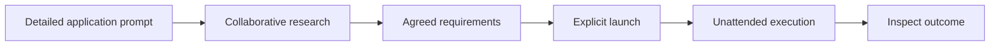

# Autonomous Coding Research on DGX

## Problem to Solve

A user wants to give a locally hosted model a high-level request, such as "I want to build a weather app," leave it working autonomously for approximately 40 hours, and return to a complete, working setup rather than a partial implementation that requires ongoing human direction. The research question is whether a model in a DGX-based environment can carry that request through to a finished application.

The environment must make it possible to investigate that end-to-end outcome, not merely demonstrate that a model can generate code or stay active for a long time. The [environment research](02-research-dgx-autonomy-environment.md) identifies separate inference, agent, and testing capabilities, but no verified end-to-end experiment environment. The user expects DGX access through SSH; the earlier hostname-resolution failure is an unresolved access check, not evidence that the host is unavailable.

## What does business success look like, and how can we measure it?

### The delivered setup lets the user launch autonomous app-building experiments

The deliverable is a working, Docker-containerized environment on DGX Spark, informed by the [environment research](02-research-dgx-autonomy-environment.md). It is not a single finished example application or a setup tied to one named model. The user can select a supported model, provide a detailed application prompt, collaboratively research and agree on requirements, and explicitly launch autonomous work with a maximum budget of approximately 40 hours.

### The agent's target outcome is a usable DGX-hosted demo

Environment readiness and agent task success are distinct outcomes. The environment enables the experiment; the experiment investigates whether the selected model can deliver the requested application as a working DGX-hosted demo, accessible through localhost on the DGX or a URL reachable by authorized Tailscale users. Public internet access is not required. A running container alone does not establish that the requested application works. A successful application build is a research result, not a prerequisite for declaring the environment ready.

### Readiness is demonstrated through an unattended experiment, not just installation

The user can launch an experiment without changing the environment's code for each supported model, leave it unattended for a budget of up to approximately 40 hours, and inspect the outcome afterward. A completed run may finish earlier after verification, testing, and refinement. This operational demonstration is the acceptance bar for the setup; successful installation or model startup alone is insufficient.

## Proposed Solution

Provide a model-agnostic, containerized autonomous coding environment on DGX Spark. Support a user workflow from model selection and a detailed application request through collaborative research, an agreed brief, explicit launch, and extended unattended execution, with a usable DGX-hosted demo as the agent's intended result. The first version enables one initial model without hardwiring the environment to that model. Expanding the supported model list and formalizing admission tests are deferred.

## Solution Details

### Each run uses one selected model across planning, implementation, and review

The first version uses one selected model for the run's planning, implementation, and review roles. The user can select a different supported model for another experiment; model-agnostic operation does not require multiple models collaborating within the same run. Role scheduling and execution architecture are deferred to the TDD.

### Model capability testing belongs to admission, not every run

The first version targets Qwen3.8-Flash-Next if it is practical on the Spark, with Qwen3.6-35B-A3B as the accepted fallback. This is a setup-time selection, not a requirement for automatic model switching during a run. Practical fit must account for the complete working environment, including the agent, application, and testing tools, rather than model loading alone.

The [environment research](02-research-dgx-autonomy-environment.md) identifies an approximately 83.8-GiB Q3 artifact for Qwen3.8-Flash-Next and third-party Spark results, but does not establish runtime fit or stability on the target host. Quantization, usable context, and host validation are deferred to technical design and setup; the preferred model is not promised to fit based on download size alone.

The environment must allow future model substitution, but a multi-model catalog and formal capability-testing workflow are not first-version priorities. When that workflow is introduced, a model must pass the capability test before being added to the supported list. It is not a test repeated as a prerequisite for each unattended run.

### The user agrees on the brief before handing over control

Before launch, the user and model collaboratively research the application, clarify its requirements, and agree on the brief. An explicit launch marks the transition into unattended execution. The agent then works against that agreed brief rather than requiring ongoing product direction from the user.

### Testing and refinement are planned work within the maximum budget

The approximately 40-hour window is a maximum, not a minimum runtime. The execution roadmap includes implementation, testing, and refinement as required work, not optional activities left until after the first implementation is declared complete. The agent can finish early once the agreed requirements have been verified and the planned testing and refinement are complete; its own completion claim alone is insufficient. At the deadline, execution stops and preserves the work and results, reporting an incomplete outcome when requirements remain unmet.

### Independent checks verify behavior; stronger-model review is manually requested

Acceptance checks are agreed during collaborative research and verified independently of the builder's completion claims. The builder can also write and run its own tests during development. The outcome distinguishes the builder's claimed completion from the acceptance-check results.

The user can manually request review of a claimed completion state by a stronger model. The review examines the agreed brief, changes, test evidence, and running application for gaps that automated checks may miss. Stronger-model review is not invoked automatically at milestones or final completion and does not gate unattended execution on an external reviewer. Independent check results and any manually requested review remain distinct evidence, rather than being presented as equivalent assurances.

### Recovery persists toward the goal rather than stopping at the first obstacle

Within the original time budget and its authorized operating boundaries, the environment automatically recovers and resumes preserved progress after recoverable failures. The agent is expected to diagnose obstacles, try alternative approaches, and continue toward the agreed goal. A failed attempt, repeated error, or temporary lack of progress alone is not sufficient reason to abandon the run; persistence must include changing approach rather than indefinitely repeating an ineffective action.

Before successful completion or the deadline, the run stops as blocked only when no viable path remains within its available capabilities and permissions. The recorded outcome explains the blocker, the recovery approaches attempted, and what would be needed to proceed. Persistence does not extend the deadline or authorize bypassing operating restrictions.

### Broad tool use stays inside the project's approved boundary

Before launch, the environment establishes the tools and permissions available to the agent. Within that boundary, the agent can use all provided tools to their full capability, install dependencies in its project environment, access the internet, edit its project, and serve its demo on the DGX through an approved access route without repeated approval requests.

The agent cannot modify unrelated DGX services, access unrelated credentials, or purchase resources. It receives no credit-card information or API keys that permit uncontrolled metered spending. These restrictions are operating boundaries, not obstacles the agent may bypass in pursuit of completion. Demo hosting must use the resources and access approved before launch.

### Demos are accessible locally or through existing Tailscale access

The application runs on the DGX and provides a usable URL for inspection. Localhost access on the DGX is sufficient; access through the existing Tailscale network can make the demo available to authorized users on other devices. No public internet exposure or external hosting account is required. Configuring the access route and isolating the demo from unrelated services are deferred to the TDD.

### Runs and demos live on the DGX independently of the user's laptop

Execution continues on the DGX when the user's laptop disconnects, sleeps, or closes its SSH session. The laptop is an access device, not a runtime dependency. The user can reconnect to inspect progress or explicitly stop the run.

The autonomous-work deadline ends agent execution, not demo availability. A running demo remains available on the DGX after the run ends so the user can inspect it, until explicitly stopped. This does not imply availability while the DGX itself is offline.

### Context resets preserve progress rather than restarting the task

Continuity across context resets is a first-version requirement. The environment preserves the agreed brief, roadmap, findings, decisions, attempted approaches, code, and test results outside the active conversation. A fresh conversation can recover the relevant working state and continue the task rather than treating the context limit as a terminal blocker or starting over. Preserved completion claims must remain distinguishable from verified results.

### SSH commands provide the operating interface without a dashboard

The first version prioritizes getting a usable experiment environment running quickly. The user operates it through SSH and a CLI to launch runs, inspect roadmap progress, view logs and results, and stop execution. The generated application has a browser URL, but the environment does not require a browser-based control panel. Avoid optional interface polish or features that delay the core autonomous workflow.

## Deferred to TDD

### Research determines the memory mechanism; continuity is required regardless

Evaluate graph-based memory alongside structured checkpoints and other suitable approaches before selecting the memory mechanism. The product requirement is to recover relevant decisions, progress, failed approaches, and evidence across context resets without starting the task over. No graph-based implementation is prescribed. Evaluation should consider retrieval relevance, stale or contradictory information, evidence provenance, and operating overhead on the Spark. External memory does not remove the selected model's context-window limit.

## Out of Scope

- A browser-based control panel for the research environment.
- A multi-model catalog and formal model-admission capability-testing workflow in the first version.
- Public internet deployment and provisioning external hosting in the first version.
- Automatic stronger-model review during unattended execution.
- Multiple distinct models collaborating within a single run in the first version.
