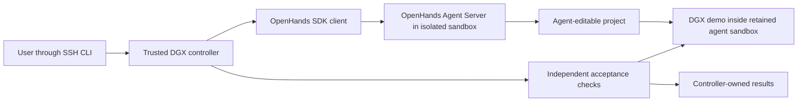
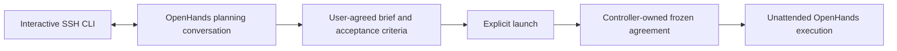
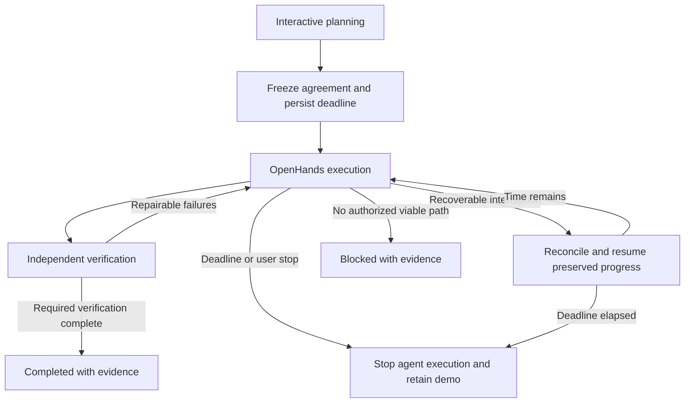

# DGX Autonomous Coding Environment

### System Design

#### A trusted controller supervises an isolated agent workspace

The [PRD](03-prd-dgx-autonomy-environment.md) requires unattended execution, independent acceptance results, and a demo that remains available after agent execution ends. A trusted controller on the DGX owns the execution deadline, recovery, and acceptance-check invocation. The agent operates in a separate sandbox and can modify its project environment, not the controller, acceptance-check definitions, or authoritative results.

The demo runs inside the agent sandbox, not in a separate application container. Stopping autonomous work stops the OpenHands conversation and its agent execution, but retains the sandbox and demo process for later inspection. The user reviews the demo after the agent is done; availability during sandbox recovery is not required. The process-control and persistence mechanisms remain to be designed.



The [research](02-research-dgx-autonomy-environment.md) establishes separate application, inference, and SDK capabilities, but no verified experiment controller connecting them. This design adds that supervisory boundary rather than extending the beach application's refresh workflow. Docker is installed on the DGX, but the inspected SSH user lacks daemon access; authorized provisioning remains a prerequisite. Existing unrelated DGX services stay outside the agent's authority.

#### OpenHands owns the agent loop; the controller owns the experiment lifecycle

Use the OpenHands SDK with a separate Agent Server in the agent sandbox. OpenHands supplies the model/tool loop, tool execution, conversation events, and conversation persistence. The controller uses those interfaces to supervise the experiment; it does not implement a competing agent loop. Custom agent loops are explicitly out of scope.

The controller remains responsible for the original wall-clock deadline, recovery coordination, continuity across fresh conversations, and independent acceptance-check execution. As the [research](02-research-dgx-autonomy-environment.md) notes, SDK conversation persistence is not an atomic checkpoint of the whole experiment. Exact compatibility between the selected model, inference runtime, and OpenHands tool calls must be verified during setup.

#### One active experiment is an operating convention, not a scheduling feature

The user launches only one active experiment at a time on the Spark. V1 does not add a scheduler or a technical concurrency gate to enforce this convention. Completed demos may remain online and still consume resources; model-fit validation must account for the application and testing workload rather than inference alone. This convention does not remove the controller's responsibility to avoid duplicate execution when recovering the same run.

#### Dedicated inference replaces competing inference during environment use

The environment uses its own llama.cpp inference service, with model and runtime settings controlled independently of the existing `claude-qwen` service. OpenHands connects to this dedicated model endpoint. The trusted controller can recover its own inference service without granting the agent host-service management privileges.

The user explicitly authorizes stopping the existing competing inference service during setup and preventing it from launching while this environment is in use. Attempts to use the displaced service must receive a clear message that the DGX inference resources are currently in use by the autonomous coding environment. This is a specific operator-authorized exception for the competing inference service, not permission to modify unrelated DGX services.

The reservation remains in place until the user explicitly releases it; experiment completion, failure, or deadline expiry does not restore competing inference. Explicit release stops this environment's inference and restores the competing service's recorded prior configuration without stopping retained demos. Restoration must account for memory still consumed by those demos.

The existing service's unit, restart triggers, and client-facing access route must be inspected before choosing the blocking and notification mechanism. Setup must preserve the prior service configuration so release can restore it. No host services have been changed as part of this design discussion.

#### Demo inspection uses loopback publication and an SSH tunnel

Publish the demo's container port only on DGX loopback. The user reviews the retained demo through an SSH local-forwarding tunnel using the existing DGX SSH access. V1 does not require direct Tailscale application publication, shared reverse-proxy changes, or public internet exposure. The tunnel is needed only for inspection; disconnecting the laptop does not stop execution or the retained demo.

```text
laptop browser -> SSH local forward -> DGX loopback port -> demo in agent sandbox
```

#### Interactive CLI planning freezes the brief at explicit launch

Before unattended execution, the user collaborates with the selected local model through an interactive SSH CLI session backed by OpenHands. Planning context stays with the run rather than requiring an externally authored brief. Explicit launch freezes the agreed brief and acceptance criteria in controller-owned storage; the agent receives a readable copy but cannot rewrite the authoritative agreement during execution. The same selected model serves planning, implementation, and review, per the [PRD](03-prd-dgx-autonomy-environment.md).



#### Acceptance checks are prepared before launch and protected from the builder

Prepare executable acceptance checks during collaborative planning and freeze them with the agreed brief at explicit launch. Store the authoritative check definitions and results outside the builder's writable workspace. The controller invokes these checks against the application and returns failure evidence to the builder for repair; the builder cannot alter the checks or authoritative results. Builder-authored tests remain separate evidence.

Independence here means protected definitions, invocation, and results, not authorship by a different model. Criteria requiring human judgment remain explicitly unverified by automation and cannot be counted as automated passes.

Run acceptance checks in a separate, disposable evaluator container that exercises the demo through browser/API requests. Its check definitions and authoritative results remain outside the agent sandbox. Generated test code does not execute directly in the trusted controller. This verification container does not change the decision to keep the demo inside the agent sandbox.

#### Recovery resumes preserved work without extending the original deadline

Automatically recover after agent or controller crashes and DGX restarts without requiring the laptop to reconnect. Persist the original absolute deadline and run state on DGX-local storage before starting unattended work. On startup, reconcile persisted intent with actual containers and conversation status before resuming; do not create a second active executor for the same run. If the deadline elapsed while offline, record expiry without restarting agent execution.

The remaining architecture below uses recommended defaults for review, rather than additional individual interview decisions.

#### A restart-managed controller owns durable lifecycle state

Run the trusted controller as a restart-managed container on the DGX. Its narrowly defined operations provision the agent and evaluator containers, manage the dedicated inference service, and preserve run records. Any Docker-daemon access belongs only to this trusted control plane, never to the agent or evaluator; daemon access is a host-privileged capability. Authorized setup provisions that access and the inference-service reservation separately from model-driven work.

Use a controller-owned SQLite database on local disk for lifecycle state, the deadline, conversation identifiers, and evaluation references. Store frozen inputs, SDK persistence, workspace data, and evidence in persistent per-run directories with separate mount permissions. Lifecycle updates are transactional within SQLite, but container operations, SDK writes, and project writes are not part of that transaction; recovery reconciles them using stable run and operation identifiers.



#### Structured checkpoints provide continuity without a graph service

Use structured checkpoints and retained SDK event history as the initial memory mechanism. Each handoff records roadmap status, decisions, findings, attempted approaches, outstanding failures, and pointers to code and test evidence. Separate agent-written claims from controller-recorded verification. Version checkpoints against the workspace revision and conversation/event position; newer records supersede older claims without erasing their history.

The PRD asks that graph memory be considered alongside simpler approaches. At design level, a graph offers explicit relationships and traversal but adds extraction, reconciliation, and retrieval machinery whose relevance benefits are not established by the current research. Structured records offer simpler provenance and inspection, but depend on a disciplined handoff and may miss relationships in long histories. Start with structured records plus selective retrieval of referenced evidence; validate continuity with forced conversation-reset tests. This is a proposed design choice, not an empirically demonstrated advantage over graph memory.

OpenHands retains responsibility for context handling within a conversation. Before a fresh conversation is required, request a handoff when possible; on crashes, resume from the last durable records and inspect current project state rather than assuming the last operation completed. Supply the frozen brief, current roadmap, recent failures, and relevant evidence to the new conversation. Exact token-budget and pause/restore APIs require verification against the pinned SDK before implementation; do not treat an event-count condenser threshold as a token budget.

#### Recovery changes approach while respecting the same operating boundary

Infrastructure failures receive bounded retry bursts with backoff and diagnostic evidence. Repeated agent failures lead to a fresh-context diagnosis using the attempted-approach history, not an endless replay of the same action. Exhausting one retry burst does not by itself end the experiment: continue with another authorized recovery approach while time remains. Record a blocked outcome only with a concrete unavailable capability or permission and the attempted alternatives. No recovery action extends the deadline, alters frozen acceptance checks, or grants additional permissions.

The controller checks the deadline independently of model calls. It requests pause/cancellation, then terminates agent execution if graceful stopping fails. Agent execution and the retained demo require distinguishable process ownership inside the sandbox. If a hard sandbox restart is necessary to stop execution, recover the demo from persisted project state without resuming the agent. Retention does not promise uninterrupted demo availability during recovery, nor does it guarantee a usable demo for an incomplete build. Verify these stop semantics against the pinned Agent Server rather than assuming pause kills child processes.

#### Network and mount boundaries keep project tools away from host authority

The agent receives its project and conversation storage, read-only agreed inputs, and access to the dedicated inference endpoint. It receives neither the Docker socket nor host credentials, controller state, or evaluator mounts. Use an unprivileged runtime with resource limits and dropped capabilities. Permit internet dependency and research access while restricting access to unrelated host, LAN, and Tailscale services through host-enforced network policy; a Docker bridge alone is not that policy.

The evaluator receives frozen checks read-only, its own evidence output location, and network access to the demo. It has no management endpoint or Docker access. Keep Agent Server management access restricted to the controller. Publish only the demo inspection port to host loopback. Resolve inference reachability explicitly on the private container network; container loopback is not host loopback.

#### Setup validates the full workload before a long experiment

Pin matched OpenHands packages, the llama.cpp revision, model artifacts, and browser/toolchain dependencies. Prefer Qwen3.8-Flash-Next only after target-host validation with agent execution, a demo, and browser checks present; otherwise use the approved Qwen3.6-35B-A3B fallback. Record measured context limits and configuration rather than inferring usable memory from GGUF bytes. This is setup qualification, not a new formal multi-model admission system or automatic mid-run model switching.

Readiness evidence includes tool-call integration, protected evaluator results, forced conversation reset, controller restart, deadline expiry while offline, and stopping agent execution while retaining or restoring the demo. Final results distinguish builder claims, independent checks, criteria awaiting human judgment, and any manually requested stronger-model review. No external reviewer is invoked automatically. A run with unresolved required verification is not reported as fully verified completion.

### Program Design

#### A separate Python package integrates OpenHands without changing the beach app

Proposed code shape: put the environment in a self-contained `autonomy/` package, independent of the existing Next.js application. Use Python 3.12+ to match the researched OpenHands SDK requirement. Pin matched SDK packages and keep runtime/container configuration with this package. The interfaces below are proposed application interfaces, not claims about exact SDK method names.

```text
autonomy/
  pyproject.toml
  src/dgx_autonomy/
    cli.py                SSH planning, launch, status, stop, release
    controller.py         Lifecycle reconciliation and deadline enforcement
    state.py              SQLite transactions and durable operation intents
    openhands_adapter.py  SDK conversation and Agent Server integration
    runtime.py            Constrained container and process operations
    checkpoints.py        Handoff validation and recovery-context assembly
    evaluation.py         Frozen check execution and evidence collection
    inference.py          Dedicated inference readiness and recovery
  config/                 Model/runtime settings without credentials
  containers/             Controller, agent, and evaluator definitions
  tests/                  Contract, integration, and recovery tests
```

The CLI talks to the long-lived controller; it does not own unattended execution. Restrict the local control endpoint to the operating user, with no public listener. Interactive planning attaches to a controller-owned conversation so losing SSH does not destroy its persisted state.

#### Lifecycle reconciliation is separate from the SDK's model and tool loop

```text
CLI plan / launch / status / stop
  controller command handler
    persist requested lifecycle transition
    wake reconciler

controller startup and periodic reconciliation
  load durable run state and original deadline
  inspect actual runtime and conversation state
  reconcile unfinished operations
  if stopped or expired: stop agent execution; retain or recover demo
  otherwise: ensure inference and workspace are available
    OpenHands adapter: create, attach, resume, or pause conversation
    observe events and persist evidence references
    on completion claim: invoke protected acceptance checks
    on failure: deliver evidence to OpenHands for repair or recovery
```

The reconciler manages process and experiment state only. It does not select tools, construct a replacement reasoning loop, or execute model-generated commands itself. Long-running SDK calls run outside the deadline-control path so an inference stall cannot block stop enforcement.

```python
class ConversationPort(Protocol):
    def inspect(self, conversation_id: str) -> ConversationSnapshot: ...
    def start(self, request: ConversationRequest) -> str: ...
    def resume(self, conversation_id: str) -> None: ...
    def pause(self, conversation_id: str) -> None: ...
    def deliver(self, conversation_id: str, evidence: EvidenceMessage) -> None: ...

class RuntimePort(Protocol):
    def inspect(self, run_id: str) -> RuntimeSnapshot: ...
    def ensure_workspace(self, spec: WorkspaceSpec) -> WorkspaceHandle: ...
    def stop_agent(self, run_id: str) -> StopEvidence: ...
    def ensure_demo(self, spec: DemoSpec) -> DemoHandle: ...
```

#### Durable intent makes interrupted operations reconcilable, not magically atomic

Use typed records for runs, operation intents, conversation references, checkpoints, and evaluations. Each run has one immutable launch deadline and frozen-input manifest; terminal outcomes and stop requests persist before cleanup. A controller writer lock prevents two controllers from operating the same state store, without introducing a global experiment-launch gate.

```text
Run
  id, phase, launched_at, deadline_at, stop_requested
  frozen_input_digest, active_conversation_id, current_checkpoint_id

Operation
  id, run_id, kind, desired_spec_digest, status, observed_resource_id

Evaluation
  id, run_id, check_digest, workspace_snapshot_id
  status, evidence_paths, started_at, finished_at
```

Before an external side effect, commit an operation intent with a stable identifier. Label runtime resources with that identifier. After success, persist the observed resource. On recovery, inspect before repeating; never assume an SDK call is idempotent or blindly replay a tool action whose effects are unknown. Write evidence files atomically where supported and record their references only after they exist. SDK event files remain SDK-owned rather than being rewritten into an invented conversation format.

#### Checkpoints assemble small recovery inputs with evidence provenance

```python
def validate_handoff(raw: str, evidence_index: EvidenceIndex) -> Checkpoint: ...
def assemble_recovery_context(
    brief: FrozenBrief,
    checkpoint: Checkpoint,
    recent_events: Sequence[EventReference],
    budget: ContextBudget,
) -> RecoveryContext: ...
```

Validate structure and evidence references, not the truth of agent claims. Keep decisions, attempted approaches, roadmap items, and verified outcomes distinct. Assemble the frozen agreement, current state, unresolved failures, and selected referenced evidence within a configured context budget. Preserve older history on disk rather than appending it all to each prompt. An incomplete handoff falls back to the last valid checkpoint plus current filesystem and SDK inspection; it must not fabricate a clean completion boundary.

#### Protected evaluation binds results to the checked project state

```text
completion claim or requested verification
  pause builder mutation and confirm quiescence
  identify project snapshot and demo revision
  start disposable evaluator with frozen checks mounted read-only
  collect bounded test output, browser evidence, and exit status
  persist result with check digest and project snapshot identity
  return failures to OpenHands, or record verified outcome
```

If quiescence or demo revision cannot be established, record the check as inconclusive rather than attributing it to an unverified snapshot. The controller owns the evidence destination; the evaluator has access only to its attempt-specific output location. Test-runner crashes are infrastructure failures, not passes or application assertion failures. Completion requires all required automated checks and the agreed testing/refinement work to be evidenced; outstanding human-judgment criteria remain explicit in the outcome.

#### Agent shutdown preserves the demo without preserving autonomous tool execution

Use separate supervised process groups for Agent Server/tool execution and the demo within the retained sandbox. A constrained demo-start operation establishes the demo group and records its launch specification; do not rely on arbitrary shell backgrounding to survive cleanup. The agent can supply project commands but cannot use this operation to acquire host privileges. This is a process-lifecycle integration, not a custom agent loop.

```text
stop_agent(run_id)
  persist stop intent
  request SDK pause and inference cancellation
  wait for bounded graceful shutdown
  terminate remaining agent/tool process group if necessary
  verify no agent execution remains
  retain demo group
  if sandbox reset was required: restart recorded demo without agent
```

Container resource limits remain effective for the retained demo. Process separation and descendant cleanup are integration-test gates; the exact implementation must follow the pinned Agent Server's actual subprocess behavior. Failure to prove cessation must be reported, not silently treated as a successful pause.

#### Dependency seams make crash and deadline behavior testable

```text
controller receives
  state repository    -> durable intent and lifecycle transitions
  clock               -> deterministic deadline and offline-expiry tests
  conversation port   -> OpenHands without live inference in unit tests
  runtime port        -> observed containers and process cleanup
  inference manager   -> readiness, cancellation, and owned-service recovery
  evaluator           -> protected acceptance evidence
  checkpoint store    -> durable handoffs and recovery context
```

Unit tests use fake clocks and injected adapters. Integration tests cover interrupted operation reconciliation, frozen-input permissions, evaluator evidence provenance, context resets, agent/demo process separation, and network restrictions. Target-host smoke tests exercise actual ARM64 images, model tool calls, inference cancellation, and restart recovery before a long unattended demonstration. Tests must distinguish proposed API contracts from behavior actually verified against the installed versions.

### Patterns to Follow

- Follow the repository's separation of storage interface and implementation, documented in the research at `lib/db/store.ts` and `lib/db/supabase-store.ts`, without coupling the new environment to the beach application's database or Supabase.
- Follow the injected subprocess-runner testing approach documented at `scripts/sim.test.ts` for runtime adapters; unit tests must not require Docker, SSH, or a loaded model.
- Reuse the external-target browser-testing approach documented at `playwright.config.ts` and `e2e/helpers.ts`, not the beach-specific assertions. The evaluator targets the generated application and emits independent artifacts.
- Keep OpenHands conversation persistence and event contracts behind the adapter described in the research. Verify exact pinned APIs before implementation; these local Python protocols are intentional integration seams, not substitutes for SDK capabilities.
