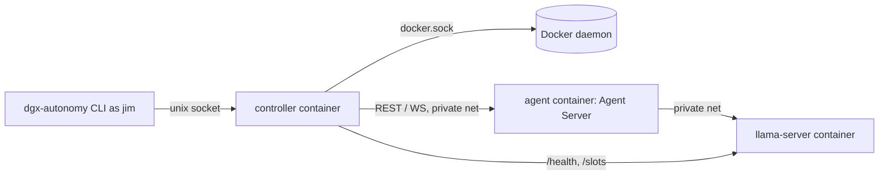

# DGX Autonomous Coding Environment

This outline builds the [TDD](04-tdd-dgx-autonomy-environment.md)'s trusted controller, isolated OpenHands agent sandbox, dedicated llama.cpp inference, and protected evaluator as a self-contained Python package, `autonomy/`, next to the beach app. Phase 1 gets one small unattended run working end-to-end on `hugo-dgx1`. Later phases each add one lifecycle guarantee from the [PRD](03-prd-dgx-autonomy-environment.md): stop and deadline, the operating boundary, crash recovery, protected acceptance checks, planning, and context continuity. The last phase qualifies the model and runs the long readiness experiment.

## Desired End State

- An operator sets up the DGX once with the privileged steps. After that, `jim` runs every experiment over SSH with the `dgx-autonomy` CLI and needs no Docker group membership.
- `dgx-autonomy plan` → `launch` → `status` / `logs` / `report` → `stop` → `release` covers the PRD workflow. `tunnel` prints the SSH local-forward command for the demo.
- A controller container managed by restarts owns SQLite lifecycle state, the fixed deadline, recovery, and evaluator invocation. The agent never gets the Docker socket, the controller state, or the frozen checks.
- Dedicated inference replaces `claude-qwen` while a reservation is held. Releasing the reservation restores the service's recorded prior configuration.
- Unit tests run in CI without Docker, SSH, or a model. The target-host smoke tests (`-m dgx`) cover tool calls, stop/retain, restart recovery, offline expiry, evaluator protection, and forced context reset.
- The config records a qualified model (Qwen3.8-Flash-Next or the Qwen3.6-35B-A3B fallback) with its measured context and memory settings. One long unattended run passes as the readiness demonstration.

## Implementation Overview

- [x] Phase 1: One trivial brief runs unattended end-to-end on the DGX
- [x] Phase 2: Deadline and stop end agent execution but keep the demo reachable
- [x] Phase 3: The operating boundary: network policy and inference reservation
- [x] Phase 4: Controller crashes and DGX restarts resume the same run
- [x] Phase 5: Protected acceptance checks decide completion
- [x] Phase 6: Interactive planning produces the frozen brief and checks
- [x] Phase 7: Context resets and stuck loops continue from checkpoints
- [x] Phase 8: Model qualification and the unattended readiness run

---

## Phase 1: One trivial brief runs unattended end-to-end on the DGX

This walking skeleton covers every layer: the CLI, the controller daemon, SQLite, the dedicated llama-server, the Agent Server in an unprivileged sandbox, and the OpenHands conversation. The input is a handwritten brief file (planning comes in Phase 6), for example "create `hello.txt` containing the date". The model is the Qwen3.6-35B-A3B Q3 fallback. It is small enough (about 17 GB) to run alongside `claude-qwen`, so this phase changes no existing host service.

### Change Outline

The package lives beside the beach app and has its own toolchain. The Next.js build, lint, and Vitest scopes don't touch it.

```diff
 claude-hackathon-volta-sep26/
+├── autonomy/
+│   ├── pyproject.toml                  + uv project; Python 3.12; pinned openhands-{sdk,tools,workspace} 1.49.4
+│   ├── README.md                       + operator setup (privileged steps) and CLI usage
+│   ├── config/
+│   │   └── models.yaml                 + qwen3.6-35b-a3b: gguf path, revision, ctx, parallel, template
+│   ├── containers/
+│   │   ├── compose.yaml                + controller service (restart: unless-stopped), private networks
+│   │   ├── controller.Dockerfile       + only image that mounts docker.sock
+│   │   ├── inference.Dockerfile        + llama.cpp @ f95b0d9, GGML_CUDA=ON, arch 121a-real (verified at build)
+│   │   └── agent.Dockerfile            + pinned Agent Server image + Node 22 / pnpm for app builds
+│   ├── src/dgx_autonomy/
+│   │   ├── cli.py                      + launch --brief, status, logs; talks to the control socket
+│   │   ├── control_api.py              + JSON-over-unix-socket server, socket mode 0600 for jim
+│   │   ├── controller.py               + reconcile loop: ensure inference → workspace → conversation
+│   │   ├── state.py                    + SQLite repository (runs, operations)
+│   │   ├── inference.py                + start owned llama-server container; poll /health and /slots
+│   │   ├── runtime.py                  + docker CLI adapter behind RuntimePort (injected runner)
+│   │   └── openhands_adapter.py        + ConversationPort over RemoteConversation / Workspace(host=…)
+│   ├── scripts/
+│   │   └── deploy.sh                   + rsync to hugo-dgx1, build images, print privileged compose step
+│   └── tests/
+│       ├── fakes.py                    + FakeClock, FakeRuntime, FakeConversation, FakeRunner
+│       ├── test_state.py               + run creation, deadline immutability
+│       ├── test_controller.py          + launch → running → finished with fakes
+│       ├── test_runtime.py             + asserts docker argv (--user, --cap-drop ALL, no socket mount)
+│       └── dgx/
+│           ├── test_tool_calls.py      + raw /v1/chat/completions tool call against owned llama-server
+│           └── test_trivial_run.py     + launch trivial brief, wait for FINISHED, file exists in workspace
 └── .github/workflows/
+    └── ci.yml                          ~ new `autonomy` job: uv sync, ruff, mypy, pytest -m "not dgx"
```

`runtime.py` builds the agent container directly instead of calling OpenHands `DockerWorkspace`. The research found that the wrapper adds no `--user`, `--cap-drop`, or security options. The adapter reaches that container through `Workspace(host=…)` on the private network.



The first schema covers only what this phase needs. Later phases extend it.

```text
runs
  id              text primary key
  phase           text     -- launched | running | finished | failed
  model_key       text
  launched_at     text
  deadline_at     text     -- written once at launch; never updated
  brief_path      text
  conversation_id text null

operations
  id              text primary key   -- stable id, also used as a docker label
  run_id          text
  kind            text     -- inference.start | workspace.create | conversation.start
  status          text     -- intended | done | failed
  resource_id     text null
```

The CLI-to-controller contract stays small and typed:

```text
launch  { brief_path, model_key, budget_hours≤40 } -> { run_id, deadline_at }
status  { run_id? }                                 -> { phase, deadline_at, conversation_status, last_event }
logs    { run_id, follow? }                         -> event stream (SDK events, summarized)
```

### Validation

#### Automated Verification

- [x] `cd autonomy && uv run ruff check && uv run mypy src`
- [x] `cd autonomy && uv run pytest -m "not dgx"`
- [x] CI `autonomy` job passes alongside the existing `pnpm` job (`autonomy · ruff · mypy · pytest` passed on the Phase 2–3 push, run 35870180163. The `pnpm` job failed there on one web-app e2e test, `e2e/timeline.spec.ts:28` on `webkit-ipad`. It depends on the date: every unrecorded day after the fixture seed's last day, Sep 12, gets a flexible column of the band, so the closed run shrinks below 3× the stub as the date moves. This is not caused by `autonomy/`, and `main` has not run since Sep 14.)
- [x] `ssh hugo-dgx1 'cd ~/dgx-autonomy && uv run pytest -m dgx tests/dgx/test_tool_calls.py tests/dgx/test_trivial_run.py'` (4 passed; use `~/.local/bin/uv`, bare `uv` is not on the non-interactive SSH PATH)

#### Manual Verification

- [x] The operator runs the privileged setup from the README once (image builds and `sudo docker compose up -d`), and `jim` can then run `dgx-autonomy status` without Docker group membership
- [x] `docker inspect` on the agent container shows no socket mount, a non-root user, and dropped capabilities
- [x] `claude-qwen` keeps serving throughout

---

## Phase 2: Deadline and stop end agent execution but keep the demo reachable

This phase adds the controller-owned wall-clock deadline, `stop`, and the retained demo. It gives the controller two process groups inside the sandbox: the Agent Server with its tools, and a demo that the agent starts through a constrained operation. The trivial brief becomes "serve a static page on port 3000".

### Change Outline

```diff
 autonomy/src/dgx_autonomy/
+├── deadline.py              + watchdog thread independent of SDK calls; uses injected clock
 ├── controller.py            ~ deadline/stop transitions; stop_agent sequence
 ├── runtime.py               ~ stop_agent(), ensure_demo(); demo port published on 127.0.0.1 only
+├── demo_tool.py             + OpenHands tool `start_demo(command, port)` → controller demo operation
 ├── cli.py                   ~ stop, tunnel (prints `ssh -L <p>:127.0.0.1:<p> hugo-dgx1`)
 └── containers/agent.Dockerfile ~ small supervisor (s6/tini) owning `agent` and `demo` process groups
 autonomy/tests/
+├── test_deadline.py         + fake clock: expiry fires while SDK call is blocked
+├── test_stop_agent.py       + pause → bounded wait → kill group → verify gone → demo kept
 └── dgx/
+    └── test_stop_retains_demo.py  + short budget; after expiry curl 127.0.0.1:<p> succeeds, no agent pids
```

The stop sequence follows the TDD exactly. The point to check against the pinned Agent Server is whether `pause()` actually kills tool subprocesses. The integration test decides that, not an assumption.

```text
stop_agent(run_id)
  persist stop intent (runs.stop_requested = 1)
  conversation.pause(); cancel in-flight llama request
  wait ≤ grace period for quiescence
  kill `agent` process group if anything remains
  verify no agent descendants  -> else record StopEvidence(failed=True)
  keep `demo` group; if the sandbox had to restart, relaunch recorded demo spec only
```

```diff
 runs
   deadline_at      text
+  stop_requested   integer not null default 0
+  outcome          text null   -- finished | expired | stopped | blocked | failed
+demos
+  run_id           text primary key
+  command          text
+  port             integer
+  host_port        integer      -- bound to 127.0.0.1
```

### Validation

#### Automated Verification

- [x] `cd autonomy && uv run pytest -m "not dgx" tests/test_deadline.py tests/test_stop_agent.py` (29 passed; full suite 126 passed, ruff and mypy clean)
- [x] `ssh hugo-dgx1 'cd ~/dgx-autonomy && uv run pytest -m dgx tests/dgx/test_stop_retains_demo.py'` (1 passed in 6 min; the Phase 1 dgx tests still pass on the new image, 4 passed)

#### Manual Verification

- [x] Run the command that `dgx-autonomy tunnel` prints on the laptop, then open the demo in a browser. Close the laptop lid, reconnect, and confirm the demo still responds. (Checked by fetching the page through the tunnel, dropping the tunnel, and reconnecting, with `-o ControlPath=none`: an SSH ControlMaster otherwise keeps the forward alive after the client exits. The lid itself was not closed.)

---

## Phase 3: The operating boundary: network policy and inference reservation

This phase makes the two operator-authorized host changes before the agent does real internet-backed work. First, host-enforced egress rules let the agent reach the internet and the owned inference endpoint, and nothing else on the host, LAN, or Tailscale. Second, `claude-qwen` is displaced, with its configuration recorded for release.

### Change Outline

```diff
 autonomy/
 ├── src/dgx_autonomy/
 │   ├── inference.py          ~ reserve(): snapshot claude-qwen unit/drop-ins → stop → mask → start owned
 │   │                         ~ release(): stop owned → restore snapshot → start; demos untouched
 │   ├── reservation.py        + reads/writes reservation record; refuses release when memory is insufficient
 │   └── cli.py                ~ reserve, release
 ├── host/
 │   ├── nftables-autonomy.nft + DOCKER-USER rules: agent net → internet + inference only;
 │   │                           deny RFC1918, 100.64.0.0/10 (Tailscale), host addresses
 │   ├── busy-notice.service   + small listener on claude-qwen's client port answering 503
 │   │                           "DGX inference is in use by the autonomous coding environment"
 │   └── sudoers-autonomy      + narrowly allows only reserve/release helper commands
 └── tests/
     ├── test_reservation.py   + snapshot round-trip; release restores exact prior unit text
     └── dgx/
         ├── test_egress.py    + from agent container: pypi.org ok; 100.x, 192.168.x, host ports refused
         └── test_reserve_release.py + reserve → claude-qwen port returns busy notice → release → restored
```

The unit, restart triggers, and client port of `claude-qwen` must be inspected first, because the TDD makes the notification mechanism depend on them. That read-only inspection is the first task in this phase.

```text
reservation
  held_since        text
  prior_unit_path   text
  prior_unit_sha    text
  prior_enabled     boolean
  prior_active      boolean
  notice_port       integer
```

### Validation

#### Implementation notes

The read-only inspection on hugo-dgx1 found the following. `claude-qwen.service` is a system unit at `/etc/systemd/system/` with no drop-ins. It runs as `jim` with `Restart=always`, is enabled, and serves Qwen3.8-27B Q8 plus mmproj on `127.0.0.1:8090` with an API key file. Docker 29.2.1 uses the iptables-nft backend. The host's DNS upstream is the LAN router, `192.168.50.1`. `br_netfilter` is not loaded. `jim` has no passwordless sudo, so every host change below is an operator step.

The implementation differs from the outline above in these ways:

- **No `systemctl mask`.** A unit whose file is in `/etc/systemd/system` cannot be masked in place, and a `--runtime` mask would neither override `/etc` nor survive a reboot. Instead, `reserve` adds one drop-in with `ConditionPathExists=!/var/lib/dgx-autonomy/reservation/record.json`. The unit file is never edited, and the block holds across a manual start, `Restart=always`, and a reboot.
- **reserve/release live in `reservation.py` plus the CLI, not in `inference.py`.** `reservation.py` is stdlib-only and installed root-owned as `/usr/local/sbin/dgx-autonomy-reservation`. The sudoers entry grants exactly `reserve`, `release` and `status`. The controller only gained `inference.stop` (refused while a run is active) and a `reservation` field in `inference.status`.
- **The egress policy is its own `inet dgx_autonomy` table, not DOCKER-USER rules.** It has `forward` and `input` hooks at priority `filter - 10` and matches the fixed bridge names `dgx-egress` and `dgx-internal`, which are set in compose. DOCKER-USER covers only forwarding, while the agent → host traffic (sshd, open-webui, `0.0.0.0` listeners) goes through `input`. The table is loaded by `dgx-autonomy-egress.service` before `docker.service`.
- **The agent gets `--dns 1.1.1.1 --dns 9.9.9.9`**, because the host's resolver sits behind the policy.
- **The controller fails closed.** It creates no agent sandbox unless two checks pass: the loader's marker (`policy/egress.json`) names the current boot, and both networks use the expected bridge names. A `network.probe` op (and `dgx-autonomy egress HOST:PORT…`) runs a throwaway container with the agent's image, networks, DNS and hardening.
- **Release refuses, and changes nothing, while the memory claude-qwen used plus 8 GiB of headroom is not available.** The footprint is measured as MemAvailable gained at stop, with the weights' size as a floor. After release, differences in the unit are reported, not overwritten.
- The unit test is `tests/test_network_boundary.py` (with `tests/test_host_files.py` for cross-file consistency and the busy notice), not a second `test_egress.py`, which would clash with the dgx one at collection.

#### Automated Verification

- [x] `cd autonomy && uv run pytest -m "not dgx" tests/test_reservation.py` (14 passed; full suite 182 passed, ruff and mypy clean)
- [x] nftables rules: `nft -c` and repeated `nft -f` with nftables 1.0.9 (the DGX's version) in a privileged local container. A behavior check used network namespaces: before loading, the agent reached the internet, LAN, tailnet and all host addresses. After loading, only the internet was reachable, every other target was refused at once (curl exit 7), and host → demo still worked.
- [x] `ssh hugo-dgx1 'cd ~/dgx-autonomy && uv run pytest -m dgx tests/dgx/test_egress.py tests/dgx/test_reserve_release.py'`
  - `test_egress.py`: 3 passed, after `sudo host/install.sh`, network recreation, and a controller rebuild on 2026-09-23. From the agent's position, `pypi.org` and the owned model are reachable. Every DGX address, the LAN router, `100.100.100.100` and the Docker gateways fail with "No route to host".
  - `test_reserve_release.py`: 1 passed in 17 s, run with `DGX_AUTONOMY_RESERVATION_TEST=1`. claude-qwen was stopped from 13:56:59 to 13:57:06 UTC. The measured footprint was 39.1 GiB, so release requires 47.1 GiB available. After release, `systemctl cat` was identical, the drop-in directory was gone, and `/health` returned 200.

#### Manual Verification

- [x] The operator reviews the nftables rules and sudoers entry before installing them (the three-action sudoers entry is accepted)
- [x] After `release`, the usual client of `claude-qwen` works again with no manual fixes (on 2026-09-23 after the release and both Phase 4 reboots, with no manual changes: an authenticated `POST /v1/chat/completions` with the service's own API key file, the way its clients call it, answered `ok` as `qwen3.8-opus`. The unit was unchanged since release, as `systemctl cat` showed right after it. Harshil's own client was not exercised.)

---

## Phase 4: Controller crashes and DGX restarts resume the same run

This phase adds durable operation intents, a controller writer lock, and startup reconciliation. A run then survives `docker kill` on the controller and a DGX reboot without creating a second executor. It also records expiry, rather than resuming, when the deadline passed while the DGX was offline.

### Change Outline

```diff
 autonomy/src/dgx_autonomy/
 ├── state.py              ~ writer lock (SQLite BEGIN IMMEDIATE on a lock row + pid/boot id)
 │                         ~ intent() / complete() / fail() around every external side effect
 ├── controller.py         ~ reconcile_on_start(): inspect labeled containers + conversation status
 │                         ~   before repeating any intended operation
 ├── runtime.py            ~ inspect(run_id) by `dgx-autonomy.op=<id>` labels
 └── openhands_adapter.py  ~ inspect() maps SDK status (RUNNING/PAUSED/FINISHED/ERROR/STUCK)
 autonomy/tests/
+├── test_reconcile.py     + table-driven: each operation × {intended, resource exists, resource missing}
+├── test_offline_expiry.py + fake clock jumps past deadline during downtime → expired, no resume
+├── test_writer_lock.py   + second controller refuses to operate
 └── dgx/
+    ├── test_controller_kill.py  + docker kill controller mid-run → restart → same conversation_id,
+    │                              one agent container, no duplicate conversation
+    └── test_reboot.md           + scripted checklist (reboot is manual)
```

```text
reconcile_on_start
  acquire writer lock or exit
  for each non-terminal run
    if now ≥ deadline_at: record expired; stop_agent; keep demo; continue
    for each operation with status=intended
      observed = inspect by label
      observed exists  -> mark done with resource_id
      observed missing -> retry that operation (never replay agent tool actions)
    conversation: attach/resume existing id; start new only if none recorded
```

### Validation

#### Implementation notes

Reading the pinned Agent Server (1.49.4) changed the plan. When it starts, it loads every conversation persisted as `RUNNING` and marks it `ERROR`, recording an `AgentErrorEvent` for the interrupted tool call (`EventService.start`). A restarted sandbox therefore always shows the run's conversation as failed. The controller would then have ended the run, so recovery reads the status the SDK persisted *before* anything restarts, and resumes the conversation when it was working. The implementation differs from the outline above in these ways:

- **The writer lock is an `flock` plus a lock row.** The controller takes an exclusive `flock` on `state/controller.lock`, and the kernel drops it however the holder dies. A lock row alone would need a lease timeout before a restarted controller could take over. The `controller_lock` row records pid, container, boot id and a token, and every write transaction checks the token, so a controller that lost the lock cannot change a run. `serve()` takes the lock before the control socket, and a second controller exits.
- **Schema v3.** `operations.attempted_at` holds when the current attempt started, and step timeouts count from it, so a reboot during launch does not time out at once. There is a new `recoveries` table: cause, `status_before`, steps as JSON, and intended/done/failed. `unique(run_id, kind)` on operations is kept. Recoveries repeat, so they are rows of their own rather than extra operations.
- **`reconcile_on_start()`** runs the offline-expiry check first. It then inspects each `intended` operation: `workspace.create` by its `dgx-autonomy.op` label, `inference.start` by name. A running resource is adopted, a stopped one is started again, a missing one is created again, and the timer restarts. An open recovery starts over from inspection but keeps its `status_before`. No runtime changes were needed for the label lookup: `inspect(run_id)` already returns the labels.
- **A recovery, not only startup reconciliation, handles the DGX restart.** On every tick, a launched or running run checks whether a finished `inference.start` or `workspace.create` has a container that is not running. If so, it records a recovery intent and brings things back in order: llama-server until ready, the sandbox (`docker start` of the same container, inside the egress policy) and the Agent Server's `/health`, the recorded demo if its session is gone, then the conversation. If the conversation was working before the restart (`status_before` not finished/error/stuck) and is now `error`/`paused`/`idle`, it gets one notice message with `run=True`. The same path covers a sandbox or llama-server crash without a reboot. A failed recovery hands its `status_before` to the next one. The Agent Server it may have restarted has already rewritten the status on disk. Backoff: the first recovery starts at once, and further ones within an hour wait 30 s, doubling up to 15 min. Recovery never fails the run; the deadline ends it. `stop_agent` abandons an open recovery.
- **`fault.inject`** (control op, `confirm` must repeat the target) crashes the controller (SIGKILL itself), a run's sandbox, or the llama-server (`docker kill`). Jim has no Docker access, so this is how `test_controller_kill.py` injects crashes. The test crashes the controller mid-run, then crashes llama-server, the sandbox and the controller together (everything a reboot takes down except the host).
- `status` gained `recoveries` and `containers` (from the op labels), and `ping` returns the lock holder. `inspect()` lower-cases the SDK status.
- Not in this phase: the retained demo of a run that had *already ended* before a reboot is not brought back. Only active runs, and runs that expire during the downtime, get their sandbox back.

#### Automated Verification

- [x] `cd autonomy && uv run pytest -m "not dgx" tests/test_reconcile.py tests/test_offline_expiry.py tests/test_writer_lock.py` (33 passed; full suite 218 passed locally and on hugo-dgx1, ruff and mypy clean)
- [x] `ssh hugo-dgx1 'cd ~/dgx-autonomy && uv run pytest -m dgx tests/dgx/test_controller_kill.py'` (2 passed in 9.5 min on 2026-09-23, after the controller rebuild. The v2 → v3 migration of the DGX database ran on first start. Controller crash: the new controller took the lock over, reattached to the same conversation and the same agent container, with no recovery and one user message. Whole-stack crash (llama-server + sandbox + controller): recovered in 53 s. The conversation waited 35 s for the dead Agent Server's lease (45 s TTL), then resumed from `error`. The run finished the brief with two user messages.)
- [x] Regression after the retained-demo fixes: `pytest -m dgx` for `test_tool_calls`, `test_trivial_run`, `test_egress`, `test_stop_retains_demo` and `test_controller_kill` gave 10 passed in 16.5 min on hugo-dgx1. The whole-stack crash recovered in 43 s. `test_reserve_release` was not repeated, because it stops `claude-qwen`.

#### Manual Verification

- [x] Reboot the DGX during a short run and confirm that it resumes without the laptop connected. Repeat with a deadline that passes during the downtime, and confirm the result is `expired` with the demo kept. (Step by step: `autonomy/tests/dgx/test_reboot.md`.)
  - Resume: run `20260923-154500-eb3c48`, `systemctl reboot` at 15:46:37 during `sleep 300`. The controller was back at 15:47:25 ("the DGX restarted since"). Recovery #1 (`llama-server is exited (exit code 0); the agent sandbox is exited (exit code 137)`, status before `running`): llama-server ready in 30 s. The same sandbox container (`15cf9337e710`) was started again, the demo was relaunched, and the conversation resumed from `error` at 15:48:02, 37 s after the controller started. The demo served `reboot demo ok` again. The agent re-ran the interrupted `sleep 300`, wrote `after-reboot.txt` and finished, with exactly two user messages (the brief and the notice).
  - Offline expiry: a DGX power-off could not be done remotely, so this used a reboot 30 s before the deadline of a 0.1 h run (`20260923-155604-149028`). At startup, 13 s after the deadline, the run was recorded `expired` before anything resumed. The stop was verified with no survivors. The sandbox came back demo-only (supervisor + demo, no Agent Server), and the demo was relaunched and served the page. There was no recovery and no message to the conversation. `claude-qwen` was healthy after both reboots.
  - Found and fixed afterwards (`tests/test_retained_demos.py`, verified live after a controller rebuild on hugo-dgx1):
    - A demo relaunched for an ended run stayed `starting` in `status`. Ended runs are not reconciled; this dates from Phase 2. The loop now checks every `starting` demo of an ended run.
    - An expired run cut off mid-step showed `conversation_status running`, which the killed Agent Server had saved. It now reads `interrupted`. An ended run whose Agent Server is gone falls back to the saved status instead of `None`.
    - The demo of a run that had already *ended* before a reboot did not come back. `reconcile_on_start` now starts such a sandbox again demo-only, if it still exists and its demo had not failed, and relaunches the recorded command. On the controller restart after the rebuild, the two finished runs' demos came back (`reboot demo ok` on 43004), with only the supervisor and the demo in their sandboxes.

---

## Phase 5: Protected acceptance checks decide completion

When the builder claims completion, the controller pauses it, pins the project snapshot, and runs frozen checks in a disposable evaluator container. The container has read-only checks, an output directory for that attempt only, and network access to the demo. Failures go back to OpenHands for repair. `report` distinguishes builder claims, automated results, criteria awaiting human judgment, and any manual stronger-model review. The brief file from Phase 1 gains a `checks/` directory. Phase 6 then generates that directory from planning.

### Change Outline

```diff
 autonomy/
 ├── containers/
+│   └── evaluator.Dockerfile   + Playwright Test (Linux ARM64, Chromium) + pytest/httpx; no docker, no mgmt net
 ├── src/dgx_autonomy/
+│   ├── frozen.py              + freeze brief + checks → controller-owned dir, sha256 manifest digest
+│   ├── evaluation.py          + quiesce → snapshot (git commit sha in workspace) → run evaluator → persist
 │   ├── controller.py          ~ FINISHED event = completion claim → evaluate; failures → deliver()
 │   └── cli.py                 ~ launch --brief DIR (brief.md + checks/), report, review-request
 └── tests/
+    ├── test_frozen.py         + agent mount is ro; digest mismatch refuses launch
+    ├── test_evaluation.py     + runner crash → infrastructure failure, never pass; no quiescence → inconclusive
+    └── dgx/
+        └── test_protected_eval.py + agent tries to edit checks/results → denied; failing check → repair loop
```

```diff
+evaluations
+  id                    text primary key
+  run_id                text
+  check_digest          text
+  workspace_snapshot_id text      -- git sha of the checked project
+  status                text      -- passed | failed | inconclusive | infra_error
+  evidence_dir          text      -- controller-owned; evaluator saw only this attempt's dir
+  started_at, finished_at text
+criteria
+  run_id, key, kind              -- automated | human_judgment
+  latest_evaluation_id  text null
```

```text
report(run_id)
  outcome: finished | expired | stopped | blocked
  builder claims            (from SDK events, labeled "claimed")
  automated checks          (per criterion, bound to snapshot + digest)
  awaiting human judgment   (never counted as passes)
  stronger-model review     (only if requested via review-request; separate section)
```

### Validation

#### Implementation notes

The implementation differs from the outline above in these ways:

- **The brief directory:** `brief.md` plus `checks/`. `checks/criteria.yaml` lists each criterion: key, description, `automated` (with its `test` file) or `human_judgment`, and `required`, which defaults to true. The file name picks the runner: `*.spec.ts` / `*.test.js` and similar go to Playwright Test, `test_*.py` goes to pytest with httpx. The checks exercise the demo from outside (`APP_URL`). The evaluator image fixes the Playwright config, so the checks are spec files only. A brief file alone, as in Phases 1–4, still launches: the run has no criteria, and the report calls its completion "claimed only".
- **Launch digest.** The CLI sends the files and the sha256 digest of what it read. The controller writes `runs/<id>/frozen/` once (write to a temporary name, then rename; 0755/0644, root-owned), reads it back, and refuses the launch if the digests differ. Nothing is left behind after a refusal. The digest is stored on the run. The launch step checks it again before creating the sandbox, and every evaluation checks it before it runs. The agent mounts `frozen/` read-only at `/brief`, replacing the single-file brief mount. The first user message tells the agent that its finish is checked.
- **Snapshots:** `snapshot.py` rather than a commit "in the workspace". The agent's own repository would run the agent's git config and hooks as root. The controller instead keeps a bare git directory, `runs/<id>/snapshots.git` (0700), and runs git with no system or global config, no hooks, no fsmonitor, no auto-gc and a fresh index each time. The snapshot id is the tree sha, so equal content gives an equal id. The project's `.gitignore` and default caches (`node_modules/`, `.next/`, …) are excluded. A symlinked project directory is refused. Verified in the real controller image (git 2.39.5): as root, over a project owned by uid 10001 with mode 0700, the agent's planted `core.fsmonitor` did not run.
- **Evaluator network: the existing egress network.** A new internal eval network was the first plan. Instead the evaluator joins the egress network, and it reaches the demo by the sandbox's name. That network already carries the audited host policy (internet yes; DGX, LAN and tailnet no), which matters because the evaluator's Chromium runs the builder's JavaScript. An internal network would also have broken apps that load CDN assets or call public APIs. The cost: like any agent, the evaluator can reach other sandboxes on that bridge, including their key-protected Agent Server ports. The evaluator is not on the internal network, so it cannot reach the model or the controller network. It starts only while `check_policy` passes. There are no new host rules.
- **One disposable container per automated criterion**, run one at a time. Each gets the checks read-only at `/checks` and a fresh directory for that criterion at `/out`, as uid 10002 with the hardening every other container gets, 4 GiB, 4 CPUs, 1024 pids and a 10-minute limit. Each step (pin, demo, start or collect one criterion, conclude) is one tick of the loop, recorded on the evaluation. A long browser test never blocks the loop or the deadline.
- **Results come only from the runner's report,** read with `O_NOFOLLOW`: Playwright's JSON report or pytest's JUnit XML. A crash, a timeout, no tests, exit 137, or no readable report counts as `error` (infrastructure), never a pass. Even pytest's exit code 1 counts as a failure only if the JUnit report shows one.
- **Quiescence is measured, not assumed.** The evaluation needs the conversation `finished` (not running) before it starts and at the end. The project is snapshotted again at the end, and a different tree makes the result `inconclusive`. No pause is sent: a finished conversation takes no further steps, and the snapshot comparison catches background writers.
- **The demo revision.** The controller snapshots the project when it starts a `start_demo` request (`demos.snapshot_id`). An evaluation whose pinned snapshot differs relaunches the recorded demo command once and waits for it to listen. A missing demo, or one that does not listen, makes the claim `failed`, with that reason sent to the builder. Nothing runs in that case.
- **Lifecycle.** A claim is identified by the id of the builder's finish action, so the same claim is never evaluated twice. `passed` finishes the run. `failed` goes back to the builder as one message with every check's status and failure excerpt, and delivery is recorded. A message to a FINISHED conversation sets it IDLE and runs it (SDK 1.49.4, `LocalConversation.send_message`), so its next finish is a new claim. `inconclusive` and `infra_error` are retried for the same claim (30 s doubling up to 15 min) and never reach the builder. A stop or deadline abandons an open evaluation and removes its containers. A run that ends without a passing evaluation (stopped, expired, or a failed conversation) gets a `final` evaluation against the retained demo, for the report only. `evaluate RUN_ID` asks for another on an ended run. A controller restart removes an open evaluation's containers, sets its evidence aside as `eval-<n>.interrupted-<time>`, and runs it again.
- **Schema v4:** `runs.frozen_digest`, `demos.snapshot_id`, and new `criteria`, `evaluations` and `reviews` tables. Per-criterion results are JSON on the evaluation, and `criteria.latest_evaluation_id` / `latest_status` point at the latest one. The migration runs in place.
- **Report and review.** `report` shows the verdict and the frozen-agreement integrity, then the claims (with the evaluations that answered each), each automated check (latest result bound to evaluation, snapshot and digest, plus its history), the human-judgment criteria, every evaluation (with `git diff --name-status` from the previous one) and the reviews. A run is VERIFIED only if it is `finished` on a passing evaluation of the intact agreement. For the stronger-model review, `review-request` writes a bundle (the agreement, `report.json`, `project.tar` of the latest evaluated snapshot, and a README) and sends nothing anywhere. `review-record` attaches the result once, in its own section.
- **Evaluator image** (`containers/evaluator.Dockerfile`): `mcr.microsoft.com/playwright:v1.63.0-noble`, pinned by index digest, matching the beach app's `@playwright/test`. It adds `npm ci` from a lockfile and pytest 9.1.1 + httpx 0.28.1 installed with `--require-hashes`. The build checks that Chromium starts. The controller image gains `git`.
- **Local integration check** (OrbStack, arm64). The real evaluator image, started with the controller's exact `evaluator_spec` argv (uid 10002, no caps), ran the two check types against a demo container. A passing page passed. A wrong heading failed with `Expected: "hello" / Received: "goodbye"`, a screenshot and a trace. A wrong `/version.txt` failed with the assertion. A syntax error in a spec was an `error` ("no tests ran").

#### Automated Verification

- [x] `cd autonomy && uv run pytest -m "not dgx" tests/test_frozen.py tests/test_evaluation.py` (28 + 30 passed, plus `test_snapshot.py` 5 and the v3 → v4 migration in `test_state.py`. The full suite had 286 passed locally and on hugo-dgx1, with ruff, ruff format and mypy clean)
- [x] `ssh hugo-dgx1 'cd ~/dgx-autonomy && uv run pytest -m dgx tests/dgx/test_protected_eval.py'` (1 passed in 2 min on 2026-09-23. This followed `docker compose --profile images build controller evaluator-image` and a controller restart, and the v3 → v4 migration ran on start. Run `20260923-202108-a78939`: `echo >> /brief/checks/…` and `touch /brief/checks/extra.py` hit "Read-only file system", and `ls /var/lib/dgx-autonomy/runs` got "No such file or directory". Evaluation #1: home passed, version failed on a 404, and the failure was delivered. The agent added `version.txt`. Evaluation #2 relaunched the demo for the new snapshot, and both checks passed, so the run finished VERIFIED. The evidence is root/10002-owned and world-readable, and `snapshots.git` is root 0700.)
- [x] Regression on the new images: `pytest -m dgx` for `test_tool_calls`, `test_trivial_run`, `test_egress`, `test_stop_retains_demo` and `test_controller_kill` gave 10 passed in 16.7 min. The whole-stack crash recovered in 53 s. `test_reserve_release` was not repeated, because it stops `claude-qwen`.

#### Manual Verification

- [x] Read one `report` for a run that repaired a failing check, and confirm that the claim, the failure, the repair, and the final pass are each attributed correctly. In run `20260923-202108-a78939`:
  - Claim 1 is linked to evaluation #1, which failed on `version` and whose failures were sent to the builder.
  - The repair shows as `A version.txt` between the #1 and #2 snapshots.
  - Claim 2 is linked to evaluation #2, which passed at snapshot `f7b2c6157f3d` with the demo relaunched.
  - The `version` history reads `#1 failed -> #2 passed`. `tidy` is listed as awaiting human judgment, and there are no reviews. The frozen digest is intact.

---

## Phase 6: Interactive planning produces the frozen brief and checks

This phase replaces the handwritten brief with the PRD's front door. `dgx-autonomy plan` attaches to a planning conversation owned by the controller, using the same selected model. The user and the model research the app and agree on requirements. The model drafts `brief.md` and executable checks into a planning area, and `launch` freezes them through the Phase 5 path. If SSH drops, planning state persists.

### Change Outline

```diff
 autonomy/src/dgx_autonomy/
+├── planning.py             + planning conversation (no demo tool, no project write outside draft/)
 │                           + tools: web research, write draft/brief.md, draft/checks/*, dry-run checks
 ├── cli.py                  ~ plan [--attach RUN] (interactive REPL), launch RUN (freezes draft/)
 ├── controller.py           ~ phase `planning` precedes `launched`; deadline set only at launch
 └── frozen.py               ~ refuses to freeze without ≥1 automated criterion; lists human-judgment ones
 autonomy/tests/
+├── test_planning.py        + detach/reattach keeps conversation id; launch freezes exact draft digest
 └── dgx/
+    └── test_plan_to_launch.py + scripted planning turns → launch → checks mounted ro in evaluator
```

```text
dgx-autonomy plan
  controller creates run (phase=planning, no deadline)
  REPL <-> planning conversation (SDK events streamed over control socket)
  user: "/checks" -> dry-run draft checks against an empty target to prove they execute
  user: "/launch --budget 40h" -> freeze(draft) -> deadline_at = now + budget -> phase=launched
```

### Validation

#### Implementation notes

The implementation differs from the outline above in these ways:

- **A plan is its own record, not a run in a `planning` phase.** Schema v5 adds a `plans` table: state `starting | open | launched | closed | failed`, model, the opening request, the conversation id, the last dry run (JSON, bound to the draft digest), and, set once at launch, `run_id` and `launched_digest`. A run still gets its deadline when it is created, which now happens at launch. So `runs.deadline_at` stays NOT NULL and immutable, and neither the watchdog nor recovery or reconciliation has to know about a deadline-less phase. `launch_plan` creates the run and marks the plan launched in one transaction, and only an open plan can launch.
- **The planner has its own sandbox,** `dgx-autonomy-plan-<id>`. It uses the agent image and hardening and both networks under the egress policy (research needs the internet). It has no published port, no `/brief` mount and no project, and `planner_memory` is 8 GiB. The conversation uses the default agent without start_demo (`ConversationRequest.demo_tool=False`). Its working directory is `/workspace`, and the draft is at `/workspace/draft/`. The planner's instructions (`planning.planning_message`) explain the draft format, what the builder has, and how checks run. The operator's request comes at the end. Each reconcile tick takes one idempotent step: model, sandbox (by name), `/health`, conversation (derived id `plan-<id>`). After 45 minutes without coming up, the plan fails. A planner sandbox that went down is started again, and the operator's next message resumes the conversation.
- **The REPL is a polling client** (`plan_repl.py`), not a WebSocket stream. `plan.events` returns agent messages and `finish` messages in full (text limit 20 000), and actions as one-liners. A turn is over once the planner has spoken and is no longer running. If it shows no sign of work 90 s after a message, the REPL stops waiting. A line starting with a command word followed by text is not run as that command: "/draft says …" was sent as `/draft` during the manual check.
- **Dry run:** `/checks` → `plan.checks` runs synchronously in the control request's thread with `run_to_completion`, at most 180 s per check. Each check runs in the evaluator image over a controller-owned frozen copy of the draft, with `APP_URL=http://127.0.0.1:3000` (the evaluator's own loopback, where nothing listens). `failed` is ok, while `passed` ("checks nothing") and `error` ("does not run") are problems. The result is recorded on the plan and sent to the planner with `run=False` (as context; it does not start a turn). `evaluation.check_container_spec` is now shared by evaluation and dry run.
- **The ≥1-automated-criterion rule applies to planned launches** (`planning.check_draft`), not to `launch --brief`, which the Phase 1–4 smoke tests use with a bare brief. `launch --plan PLAN [--yes [--skip-dry-run]]` launches without the REPL.
- `inference.stop` (and so `release`) is refused while a plan is active.

#### Automated Verification

- [x] `cd autonomy && uv run pytest -m "not dgx" tests/test_planning.py` (15 passed; full suite 302 passed, ruff, ruff format and mypy clean)
- [x] `ssh hugo-dgx1 'cd ~/dgx-autonomy && uv run pytest -m dgx tests/dgx/test_plan_to_launch.py'` (1 passed in 3.4 min on 2026-09-23, after a controller rebuild; the v4 → v5 migration ran on start. The planner wrote the dictated draft. `fault.inject controller` crashed the controller mid-plan, and the plan came back `open` with the same conversation and draft digest. A second turn changed the heading. The dry run reported both checks `failed` against the empty target. Launch froze the reviewed digest and removed the planner sandbox. Run `20260923-210034-a4d059` finished VERIFIED, and its `checks-read-only` check proved from inside the evaluator that `/checks` cannot be written.)

#### Manual Verification

- [x] Plan a small app over SSH, close the laptop mid-conversation, reattach, and launch. The frozen brief matches what was agreed. (Plan `20260923-210451-68ab98`, a tip calculator, driven through the real REPL in tmux on the DGX. The planner asked five clarifying questions and proposed defaults. After the answer, the REPL session was killed mid-turn, which is what a closed laptop does to it. The planner wrote the draft while nobody was attached. `plan --attach` replayed the conversation. `/draft` refused the draft because `criteria.yaml` named `invalid-input.spec.ts` while the file was `invalid_input.spec.ts`. The planner fixed it when told. `/checks` reported all 7 automated checks ok (each runs and fails with no app). `/launch 2` froze `sha256:9b59d248…` as run `20260923-211903-30bba7`. `diff -r` of the draft against `runs/<id>/frozen` differs only by the controller's `manifest.json`.)

---

## Phase 7: Context resets and stuck loops continue from checkpoints

This phase adds structured checkpoints and fresh-conversation rollover. Before the context runs out, or after STUCK or ERROR, the controller asks for a handoff, validates it, and starts a new conversation. The recovery context holds the frozen brief, the checkpoint, the recent failures, and selected evidence. Repeated failures cause a diagnosis with fresh context instead of a replay. The `blocked` outcome needs a concrete missing capability and a list of the alternatives tried.

### Change Outline

```diff
 autonomy/src/dgx_autonomy/
+├── checkpoints.py          + validate_handoff(), assemble_recovery_context(budget)
+├── handoff_tool.py         + agent tool `write_handoff(...)` → structured JSON into run dir
 ├── controller.py           ~ rollover triggers: token-usage threshold (from llm.metrics), STUCK, ERROR burst
 │                           ~ retry bursts with backoff for infra errors; approach history drives diagnosis
 └── openhands_adapter.py    ~ start(request with recovery context); condenser configured with max_size
 autonomy/tests/
+├── test_checkpoints.py     + missing evidence ref rejected; claims vs verified kept apart; budget trimming
+├── test_rollover.py        + fake STUCK → handoff → new conversation id → same run, same deadline
 └── dgx/
+    └── test_forced_reset.py + force rollover mid-task; new conversation finishes without redoing done items
```

```diff
+checkpoints
+  id                   text primary key
+  run_id               text
+  conversation_id      text
+  event_position       integer
+  workspace_sha        text
+  supersedes_id        text null
+  roadmap_json, decisions_json, attempts_json, failures_json, evidence_refs_json  text
+  source               text  -- agent_handoff | controller_fallback
 runs
+  current_checkpoint_id text null
```

The rollover threshold is a token budget read from usage metrics, not the condenser's event-count `max_size`. Before implementation, confirm the exact token-budget API at v1.49.4. This is an open question carried over from the research.

### Validation

#### Implementation notes

The token-budget question is answered for SDK 1.49.4. Two mechanisms measure context, and the rollover uses neither `max_size` nor its own token counting:

- **Inside a conversation,** the SDK's `LLMSummarizingCondenser` (the default agent's, `max_size=80`, `keep_first=4`) already condenses on tokens. It condenses when `get_total_token_count(view) > min(max_tokens, llm.effective_max_input_tokens)`, and `max_input_tokens` is set to the model's `ctx`. So OpenHands keeps a single conversation within the context window by itself.
- **The rollover threshold** reads the conversation's usage stats: `GET /api/conversations/{id}` → `stats.usage_to_metrics.agent.accumulated_token_usage.per_turn_token`. That is prompt + completion of the latest call; accumulation keeps the latest (`TokenUsage.__add__`). When it reaches 85% of `ctx`, the controller rolls over, before the context runs out.

The implementation differs from the outline above in these ways:

- **Schema v6:** `conversations` (every conversation of a run: number, derived id, status `handoff | starting | active | ended | abandoned`, reason, detail, the checkpoint it started from, the handoff request) and `checkpoints` (the columns listed above, plus `reason`, `verified` and `problems`). The handoff is stored as one JSON (`roadmap`, `decisions`, `attempts`, `open_failures`, `next_steps`, `notes`), not as a column per part. `runs` gains `current_checkpoint_id` and `blocked`. `runs.conversation_id` always names the active conversation. The migration makes every existing conversation #1.
- **The agent tools are `handoff_tool.py`:** `write_handoff` plus `declare_blocked`. They use the demo tool's file protocol (request in `/workspace/.dgx`, answer in `/dgx-control`), and they *wait for the controller's validation*, so problems go back to the agent within the same tool call. The agent image loads both modules. `ConversationRequest.builder_tools` gives the builder all three custom tools, and the planner none.
- **Triggers:** `stuck`, `errors` (after 3 nudges within an hour, with backoff 30/60/120 s), `context` (85%), `failures` (3 failed claims in a row within the active conversation), `blocked-review`, and `forced` (`dgx-autonomy rollover`, which the dgx test uses). **An ERROR or STUCK conversation no longer fails the run.** Only the deadline, a stop, or a confirmed blocker end it, as the PRD requires. At least 10 min must pass between context/failures rollovers, and 1 min between stuck/errors ones.
- **Fallback:** when there is no valid handoff within 10 minutes, the controller records a `controller_fallback`. It holds the previous valid handoff, marked as older, and the old conversation's last actions as observed. It marks nothing done. The recovery context is at most 25% of `ctx` (about 3 chars per token). Sections are trimmed from the least important up: last actions, then recent failures, then the brief (which points at `/brief/brief.md`), then the checkpoint.
- **`blocked` requires two conversations:** a valid declaration starts a `blocked-review` rollover, and only a declaration from that fresh conversation stops the run as `blocked`. The run records the blocker, the first declaration, and the confirming conversation.
- Found on hugo-dgx1 while testing: **nothing capped a response's length.** OpenHands sent no `max_tokens`, and llama-server's `n_predict` was -1. A reasoning loop in the tip-calculator run generated 10 000+ tokens over 20+ minutes on the only slot, while a second run queued behind it. Every model now has `max_output_tokens` (default 16 384). It is sent by the LLM config, and it is llama-server's `--n-predict` default for requests that send none. After the fix, the same loop stopped at 16 384 tokens.

#### Automated Verification

- [x] `cd autonomy && uv run pytest -m "not dgx" tests/test_checkpoints.py tests/test_rollover.py` (10 + 11 passed, plus `test_handoff_tool.py` 4 and the v5 → v6 migration in `test_state.py`; full suite 338 passed, ruff, ruff format and mypy clean)
- [x] `ssh hugo-dgx1 'cd ~/dgx-autonomy && uv run pytest -m dgx tests/dgx/test_forced_reset.py'` (1 passed in 40 min on 2026-09-23, after the agent image and controller rebuild; the v5 → v6 migration ran on start. The run was `20260923-213805-af5a17`, sharing the single inference slot with the tip-calculator run. The rollover was forced right after `step3.txt` appeared. The builder finished step 4 before it answered the HANDOFF REQUEST, and its first `write_handoff` was accepted. Conversation #2 started from checkpoint #1, wrote steps 5 and 6, and served the demo. Evaluation #1 passed, so the run finished VERIFIED before the same deadline. `step1–3.txt` kept their mtimes.)

#### Manual Verification

- [x] Read the checkpoint chain for the forced-reset run. It should read as a coherent handoff, with no fabricated completion boundary. (`dgx-autonomy checkpoints 20260923-213805-af5a17`: checkpoint #1 is `agent_handoff`, from conversation #1 at event 27, snapshot `ef78c45bab6b`. The roadmap lists steps 1–4 `done`, each with its file as evidence (the controller checked that it exists), and step 5, step 6 and start_demo as `todo`, with matching next steps. Nothing that had not happened is marked done. The claims sit in the handoff and the controller's `verified` (no evaluation yet) is separate.)

---

## Phase 8: Model qualification and the unattended readiness run

This phase qualifies the preferred model with the full workload running, and records the measured configuration. It then runs the whole readiness suite and one unattended experiment of up to 40 hours as the acceptance bar in the PRD.

### Change Outline

```diff
 autonomy/
 ├── config/models.yaml       ~ add qwen3.8-flash-next (UD-Q3_K_XL, 3 shards, pinned revision)
 │                            ~ per model: measured ctx, parallel, cache types, memory headroom, status
 ├── src/dgx_autonomy/
+│   └── qualify.py           + load model + agent + demo + evaluator browser; tool-call suite;
+│                              long-prompt run; sample MemAvailable/swap; write measurements
 │   └── cli.py               ~ qualify MODEL, readiness (runs every dgx smoke test in sequence)
 └── tests/dgx/
+    └── test_readiness.py    + aggregates Phase 1–7 dgx tests into one recorded readiness report
```

```text
qualify qwen3.8-flash-next
  pass -> models.yaml status=qualified, default model
  fail -> record why (OOM, tool-call parse, instability); qwen3.6-35b-a3b stays default
```

### Validation

#### Implementation notes

The implementation differs from the outline above in these ways:

- **Qualification runs in the controller** (`qualify.py`, control ops `qualify.start` / `qualify.status`, CLI `qualify MODEL` and `qualification`). Model swaps and runs need Docker, which jim does not have. It runs on a background thread, one step at a time:
  - **preflight:** no run or plan is active, and there is memory for the weights plus 8 GiB, counting what removing the current model frees.
  - **load:** the owned llama-server is switched to the model.
  - **tool calls:** five probes through llama.cpp's parser: a single argument, a choice between tools, a nested array of objects (the shape of `write_handoff`), a shell command, and a tool-result round trip.
  - **long prompt:** 75% of `ctx`, with recall of a word from the start.
  - **workload:** a real run with a demo and a Playwright check plus a pytest check, which must finish VERIFIED.

  MemAvailable and swap are sampled every 5 s. The record goes to `qualification/<model>/<time>.json`. `models.yaml` gets the values by hand (the controller reads its packaged copy). The measured numbers are under `measured:`, which the loader ignores.
- **Readiness is `readiness.py` + `dgx-autonomy readiness`**, not a pytest file that runs pytest. Each dgx suite runs in its own pytest process with JUnit output, and the result is one `readiness/<time>/report.{md,json}` naming the model. The reboot checks stay manual (`test_reboot.md`). `test_reserve_release.py` runs only with `--with-reservation`.
- **New guards found on the way:**
  - The controller refuses to create a llama-server when MemAvailable is below the weights plus 8 GiB. The error points at the reservation, so the Flash-Next default cannot be loaded next to claude-qwen.
  - `inference stop` switches models between runs.
  - `retire` takes ended runs' retained demos down. The PRD says demos stay "until explicitly stopped", and there was no way to stop them.
  - The planning dry run also runs every check against a throwaway **reference app** the planner writes (`draft/reference/`, never frozen). This catches checks that no app can satisfy, which the tip-calculator plan below had.

#### Automated Verification

- [x] `ssh hugo-dgx1 'dgx-autonomy qualify qwen3.8-flash-next'` writes measurements and a qualified/failed status (**qualified**, 2026-09-23 23:20–23:27 UTC, with the reservation held. Load took 40 s and 87.7 GiB. The tool-call probes passed 5/5. A 51 457-token prompt ran at 632.8 tokens/s prefill and 19.5 tokens/s decode and recalled the word. Workload run `20260923-232304-23ca30` finished VERIFIED. Minimum MemAvailable was 23.9 GiB, and swap did not grow. The fallback `qwen3.6-35b-a3b` also qualified: 20 s, 17.6 GiB, 5/5, 2119.8 / 52.5 tokens/s, run `20260923-232902-394983` VERIFIED. `models.yaml` now marks both qualified, and the default is `qwen3.8-flash-next`.)
- [x] `ssh hugo-dgx1 'dgx-autonomy readiness'` passes on the default model (**PASSED** on `qwen3.8-flash-next`, 2026-09-23 23:34 → 2026-09-24 00:15 UTC, report `~/dgx-autonomy/readiness/20260923T233455/report.md`. 8 suites and 15 tests: tool calls, a trivial run, egress, deadline stop keeping the demo, controller and whole-stack crashes, protected checks, planning to launch (the reference app passed), and the forced reset. `test_reserve_release.py` was not rerun, because the reservation was held at the time. The reboot checks remain the Phase 4 manual record.)

  Further findings while running the readiness experiment on Flash-Next, all fixed and deployed:
  - **The SDK's LLM timeout (300 s) was shorter than a long answer takes** (16 000 tokens at 26 tokens/s is about 10 min). The client abandoned and retried; the planner looked idle for 25 minutes while llama.cpp generated abandoned answers. Each model now has a `request_timeout_s` (1800 s).
  - **Unbounded thinking:** the planner reasoned through the whole draft for 16K tokens before writing a file. Each model now has a `reasoning_budget` (8192, via llama.cpp `--reasoning-budget` and a closing message), and Flash-Next gets `max_output_tokens: 24576`.
  - **Flash-Next's template keeps every turn's thinking in the history by default:** `--no-reasoning-preserve`.
  - The REPL now waits out a controller restart instead of returning to the prompt.

#### Manual Verification

- [x] Plan and launch a real app (for example, the weather app) with a 40-hour budget, disconnect, and come back. Check `report`, and open the demo through `tunnel`. The environment is ready whether or not the app succeeded, provided the lifecycle behaved correctly.
  - **Planning:** plan `20260924-005215-399f74` ran on `qwen3.8-flash-next` in the REPL. A first attempt was closed after the timeout and thinking-budget findings above. The planner researched Open-Meteo with curl, including its no-result and ambiguous-city cases, and asked four design questions. It proposed 7 automated criteria plus 1 human-judgment one. All Playwright checks intercept both Open-Meteo hosts with shared fixtures, including an upstream-500 path. It wrote a static reference app on the same fixtures. `/checks`: all 7 failed against the empty target and passed against the reference.
  - **Launch:** `/launch 40` froze `sha256:867620e0…` as run `20260924-093913-0bbd61`, deadline 2026-09-26 01:39 UTC. The laptop then slept, and lost connectivity for hours at a time.
  - **The unattended run:**
    - The builder wrote the app and ran the frozen checks itself.
    - Claim 1 failed all 7 checks: a stray `http.server --bind 127.0.0.1` it had started kept port 3000, so the demo was not reachable from the evaluator. The failures went back to it.
    - At 55 781 of 65 536 context tokens, a `context` rollover took the builder's own `write_handoff` (checkpoint #1, `agent_handoff`), and conversation #2 continued.
    - The builder diagnosed the port problem ("a serving/binding problem, not an app bug") and fixed the serving. Claim 2 passed evaluation #2, 7/7. The run finished **VERIFIED** at about 11:00 UTC, 1 h 20 min into its 40 h budget. The frozen digest was intact. `pleasant-on-phone` awaits human judgment.
  - **Coming back:** `report` showed each claim with its evaluation, the per-check history (`#1 failed -> #2 passed`) and both conversations. Running the command `tunnel` prints on the laptop, then `curl` through the forward, served the app. A phone-size Chromium screenshot with live Open-Meteo data for Halifax is `weather-app-demo.png` in this task. It shows current conditions and a 5-day forecast. One visible flaw is for the human-judgment criterion: the page background ends mid-page, which leaves the "Recent searches" label white on white.
  - **Afterwards:** `dgx-autonomy release` restored claude-qwen (active, `/health` ok). The reservation had been held from 2026-09-23 23:20 UTC for qualification, readiness and this run.

---

## Open Questions

- Which model loads first in Phase 1: Qwen3.6-35B-A3B, so it can coexist with `claude-qwen`, or is displacing `claude-qwen` acceptable from day one? That choice decides whether the reservation stays in Phase 3.
- Where does the operator's privileged setup live? Options: a root-owned systemd unit that runs `docker compose`, or the compose file's restart policy on its own. And is the narrow sudoers entry in Phase 3 acceptable, or should reserve/release stay manual operator steps?
  - Answered in Phase 3: the sudoers entry that allows only `reserve`, `release` and `status` is accepted. `claude-qwen` (Qwen3.8-27B Q8, dense) belongs to Harshil. The environment runs its own sparse-MoE instance: Qwen3.6-35B-A3B now, and Qwen3.8-Flash-Next once Phase 8 qualifies it. Displacing `claude-qwen` only frees its memory.
- Egress policy: is an nftables DOCKER-USER allowlist on the DGX acceptable, given that it sits alongside Caddy, cloudflared, and Tailscale rules?
- Can `pause()` on Agent Server v1.49.4 reliably kill tool subprocesses? If not, is the supervisor-owned `agent` process group the enforcement point (Phase 2)?
  - Answered in Phase 2 (`test_stop_retains_demo.py` on hugo-dgx1): no. After `/interrupt` and `/pause` the conversation reported `paused` and the foreground tool call was cancelled, but the tmux server, its bash, and a backgrounded `nohup sleep` all survived, along with the Agent Server and its openvscode-server. The enforcement point is the controller's kill of every sandbox process outside PID 1, the demo session, and `docker exec` processes. A process-tree kill of the Agent Server would miss tmux, which reparents itself to PID 1.
